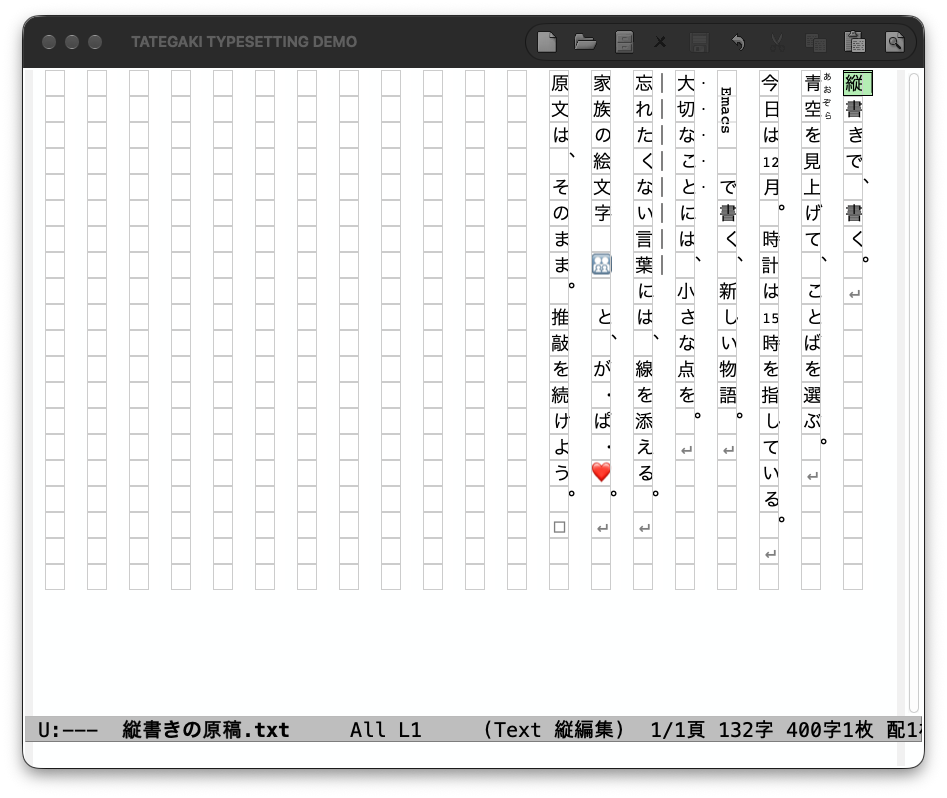

# my-tategaki

Emacsで、日本語の原稿を縦書きのまま書くための編集環境です。元のテキストファイルを通常どおり保存・Undoしながら、ルビや禁則を含む組版表示、原稿用紙、脚本・台本、アウトラインを使えます。横書きで編集しながら縦書きを確認するプレビューもあります。

編集・プレビューはpure Elispで動きます。任意のDocker出力機能を追加すると、開始時点の同じ原稿からTXT・DOCX・PDF・EPUB・HTMLをまとめて作れます。

**日本語マニュアル:** [ローカルの入口](docs/index.html) · [GitHub Pages版](https://modeverv.github.io/my-tategaki/)（Pagesを有効化すると公開されます。[公開手順](#github-pagesでマニュアルを公開する)）


## できること

| したいこと | 入口 | 詳しい説明 |
|---|---|---|
| 縦書きで入力・保存する | `M-x tategaki-edit` | [編集と移動](docs/manual/editing.html) |
| 禁則・ルビ・縦中横を使う | `M-x tategaki-typeset-edit` | [組版と原稿用紙](docs/manual/typesetting.html) |
| 20字×20列などの版面で書く | `M-x tategaki-manuscript-set-preset` | [組版と原稿用紙](docs/manual/typesetting.html) |
| 全文・選択範囲・章の文字数を見る | 縦書き編集のモードライン | [設定リファレンス](docs/manual/reference.html) |
| 自動字下げ・括弧補完を使う | 縦書き編集で既定で有効 | [執筆支援](docs/manual/writing.html) |
| 人物名・台詞・ト書きを揃える | `M-x tategaki-script-mode` | [脚本・台本](docs/manual/writing.html) |
| 見出しから本文へ移動する | `C-c C-o` / `M-x tategaki-outline` | [アウトライン](docs/manual/writing.html) |
| 日本語IME・Copilot・Corfuを使う | 対応環境で自動連携 | [入力と補完](docs/manual/editing.html) |
| 横書きのまま縦書きを確認する | `M-x tategaki-preview` / `tategaki-preview-frame` | [プレビュー](docs/manual/getting-started.html#preview) |
| 原稿を一括出力する | `M-x tategaki-export-all` | [Docker出力](docs/manual/export.html) |
| 症状から設定を確認する | 描画・入力・キー・Dockerの切り分け | [困ったとき](docs/manual/troubleshooting.html) |

## 最短で始める

対象はEmacs 27.1以降の `text-mode` とその派生モードです。実機の主な検証環境はmacOSのEmacs 31.1です。通常の編集にDockerは要りません。ルビ等の組版表示にはGUIとSVG対応が必要です。

1. リポジトリを手元に配置します。例: `git clone https://github.com/modeverv/my-tategaki.git ~/src/my-tategaki`
2. `init.el` に次を追加して評価します。配置先が異なる場合はパスを変更してください。

   ```elisp
   (add-to-list 'load-path (expand-file-name "~/src/my-tategaki"))
   (require 'tategaki)
   ```

3. `.txt` ファイルを開き、`M-x tategaki-edit` を実行します。新規バッファが `fundamental-mode` の場合は先に `M-x text-mode` を実行します。
4. そのまま文字を入力します。`C-x C-s` で保存、`C-/` でUndo、`C-c C-c` で同じ位置の横書きに戻ります。

ルビや禁則を試す場合は、`｜青空《あおぞら》` と入力し、`M-x tategaki-typeset-edit` を実行してください。注記を含む原文をそのまま保存し、表示だけを組み替えます。

導入の詳細は[はじめに](docs/manual/getting-started.html)、すぐに使うキーは次の表を参照してください。

| 操作 | キー |
|---|---|
| 読む順序で次／前の文字へ | `↓` / `↑` |
| 左／右の縦列へ | `←` / `→` |
| 次／前の画面へ | `C-v` / `M-v` |
| 範囲選択 | `C-SPC` の後に移動、またはドラッグ |
| コピー／切り取り／貼り付け | `M-w` / `C-w` / `C-y` |
| 再描画 | `C-c C-l` |
| アウトライン | `C-c C-o` |
| 横書きに戻る | `C-c C-c` |

`C-f` / `C-b` / `C-n` / `C-p` を画面上の右・左・下・上に合わせる場合は、`(setq tategaki-physical-navigation t)` を追加します。初期設定では通常のEmacsの割り当てを保ちます。

## 用途から読む

- **小説・散文を書く:** [はじめに](docs/manual/getting-started.html) → [移動と編集](docs/manual/editing.html) → [ルビ・原稿用紙](docs/manual/typesetting.html)。自動字下げと目標文字数は[執筆支援](docs/manual/writing.html)へ。
- **脚本・台本を書く:** [脚本モード](docs/manual/writing.html)でシーン・人物名・台詞・ト書きの書式と入力コマンドを確認します。
- **既存原稿を読む:** 横書きで編集を続けるなら[プレビュー](docs/manual/getting-started.html#preview)、縦書きの本文へ直接触れるなら `tategaki-edit` を使います。
- **提出・校正・電子書籍にする:** [Docker出力](docs/manual/export.html)でプロファイルを選び、形式別レポートと生成物を確認します。
- **余白・字間・キーを自分に合わせる:** [設定リファレンス](docs/manual/reference.html)。症状がある場合は[困ったとき](docs/manual/troubleshooting.html)から確認できます。

## 出力を追加する

Docker Desktopを起動し、このリポジトリで次を実行します。初回構築にはネット接続が必要です。通常の出力はネット接続なしで動き、ホストにPython・Node・Java・Pandocを用意する必要はありません。

```sh
./bin/tategaki-export build
./bin/tategaki-export doctor
```

Emacsで `M-x tategaki-export-all` を実行すると、未保存の編集内容を含めて開始時点の原稿を固定し、別プロセスで出力します。既定はnarrowingにかかわらず全文です。`C-u M-x tategaki-export` で出力範囲を選べます。

```sh
./bin/tategaki-export export "小説 原稿.txt" \
  --profile preview --formats txt,docx,pdf,epub,html --out ./dist
```

完了後は `M-x tategaki-export-status` または出力先の `report.md` を確認します。原文保存版と本文抽出版の違い、設定例、取消、部分失敗時の扱いは[Docker出力マニュアル](docs/manual/export.html)にまとめています。実装更新後は再度 `build` してください。

## 対応範囲と制約

| 項目 | 現在の扱い |
|---|---|
| 端末Emacs・SVG非対応GUI | 原文の文字表示で編集。ルビ等の組版・縮小した原稿用紙表示はGUI＋SVGが必要 |
| 入力形式 | プレーンテキストと限定した青空文庫注記。Markdown・Org全体を組版用に解釈する機能ではない |
| IME | macOS NS版の対応関数がある環境で未確定文字を縦書き表示。候補一覧はOS標準の横書き |
| 表示と原文 | 描画記号・補完の仮表示は原文に入らない。注記挿入・字下げ・脚本整形は通常の本文編集として保存される |
| ページ数 | 画面の版面、400字換算、Wordのページ、PDFのページ、EPUBの再配置は別の指標 |
| DOCX | LibreOfficeで描画・再保存を検証。Wordの最終実表示は未確認。LibreOfficeでは一部ZWJ絵文字が分かれて見える |
| PDF | 提出・校正用。検証済みフォントはNoto Serif CJK JP。固定字数・列数、印刷所別PDF/X・塗り足し・色変換は未対応 |
| EPUB | リフロー型EPUB 3。フォント埋め込み・画像表紙は未対応。Books 9.0では記号付き章名の目次に既知の表示問題。Kindle Previewerは未検証 |
| 動作環境 | Docker実測はApple Silicon / linux/aarch64。amd64の実行は未確認 |

検査の成功と、特定の閲覧アプリ・提出先での適合は区別しています。実施範囲と未確認項目は[縦書き編集の検証記録](docs/vertical-typesetting-validation.md)と[Docker出力の検証記録](docs/docker-export-validation.md)を参照してください。

## GitHub Pagesでマニュアルを公開する

このリポジトリには公開用ファイルを `docs/` に用意しています。**Pagesの有効化・公開元の設定は利用者が行います。既存のPages設定はこの変更では操作していません。** 公開する場合は、リポジトリの管理権限を持つユーザーが次の設定を行います。

1. `main` ブランチに今回の文書が入ったことを確認します。
2. GitHubの [Settings → Pages](https://github.com/modeverv/my-tategaki/settings/pages) を開きます。
3. **Build and deployment → Source → Deploy from a branch** を選びます。
4. Branchを **main**、フォルダーを **/docs** にして **Save** を押します。
5. GitHubの公開処理が完了したら、[公開予定URL](https://modeverv.github.io/my-tategaki/)を開いて確認します。

ブランチと `/docs` を公開元にする設定は[GitHub公式の公開元設定ガイド](https://docs.github.com/en/pages/getting-started-with-github-pages/configuring-a-publishing-source-for-your-github-pages-site)に従っています。既に別の公開元を運用している場合は、その設定との関係を確認してから切り替えてください。ローカルでは `docs/index.html` をブラウザで開けます。本文の更新と再生成の手順は[マニュアル保守ガイド](docs/MANUAL-MAINTENANCE.md)を参照してください。

## README内の詳しい説明

以下には従来の詳しい操作説明・設定例・検証手順を残しています。普段の参照には章ごとに分かれた[日本語マニュアル](docs/index.html)を利用できます。

<a id="detail-editing"></a>
<details>
<summary>縦書き編集・表示設定・検索</summary>

## 縦書きで書く

Emacs 27.1 以降が対象です。このディレクトリを `load-path` に追加し、`tategaki` を読み込みます。

```elisp
(add-to-list 'load-path "/path/to/my-tategaki")
(require 'tategaki)
```

テキストファイルを開き、`M-x tategaki-edit` を実行してください。現在のウィンドウが縦書き表示になり、そのまま文字を入力できます。文字は上から下、列は右から左へ進みます。`M-x tategaki-mode` でも有効・無効を切り替えられます。

`tategaki-edit` は既定では原文を1文字ずつ並べます。禁則、縦中横、ルビ等を使う場合は `M-x tategaki-typeset-edit` で組版表示を選びます。こちらも同じファイルバッファを編集します。組版表示にはGUIとSVG画像のサポートが必要で、利用できない環境では注記を含む原文の文字表示へ戻ります。

すでに `org-tategaki-preview` を読み込む設定がある場合も、新版を読み込み直せば `tategaki-edit` をそのまま使えます。

編集対象は元のファイルバッファです。その上に縦書きの表示レイヤーを重ねるため、入力、削除、保存、undo は通常の Emacs の操作を使います。表示を実カーソルの前後に分け、縦書きの各文字へ実カーソルを配置します。終了時は `C-c C-c` で同じ位置の横書き表示に戻れます。元バッファが読み取り専用なら、その制限も引き継ぎます。


Emacs 31.1での実画面です。明朝体・配色と上部のキー案内は、この表示例用に調整しています。

| 操作 | キー・コマンド |
| --- | --- |
| 縦書き編集を開始 | `M-x tategaki-edit` |
| 組版表示で編集を開始 | `M-x tategaki-typeset-edit` |
| 読む順序で次／前の文字へ | `↓` / `↑` |
| 左／右の縦列へ | `←` / `→` |
| 次／前の縦書きページへ | `C-v` / `M-v`、`PageDown` / `PageUp` |
| 文字の位置へ移動 | その文字をクリック |
| 範囲を選択 | `C-SPC` の後に移動、または文字から文字へドラッグ |
| 切り取り／コピー／貼り付け | `C-w` / `M-w` / `C-y` |
| 保存 | `C-x C-s` |
| undo | `C-/` または `C-x u` |
| 再描画 | `C-c C-l` / `M-x tategaki-refresh` |
| 選択範囲にルビを付ける | `C-c C-r` / `M-x tategaki-insert-ruby` |
| 注記の組版／原文表示を切り替える | `C-c C-a` / `M-x tategaki-toggle-annotations` |
| 指定ページへ移動 | `C-c C-p` / `M-x tategaki-goto-page` |
| アウトラインを開く | `C-c C-o` / `M-x tategaki-outline` |
| 横書きへ戻る | `C-c C-c` / `M-x tategaki-quit` |

上下の矢印は、通常の原文表示では原文の1文字単位、組版表示では結合文字・縦中横等をまとめた表示単位で進みます。列の末尾では次の列へ移ります。左右の矢印は縦列を移動し、できるだけ同じ高さを保ちます。カーソルが表示範囲を越えると、対応する列を含むページへ表示が切り替わります。`C-f` / `C-b` などは初期設定では元の割り当てを保ち、以下の設定で画面上の方向へ切り替えられます。選択範囲も原文の順序に沿った連続した範囲になります。

対象は `text-mode` とその派生モードです。Markdown・Org でも使えます。見出し記号や通常のMarkdown記法は原文のまま表示し、組版表示では後述の青空文庫形式の注記だけを解釈します。新規バッファが `fundamental-mode` の場合は、先に `M-x text-mode` を実行してください。

`C-v` は左側の次ページ、`M-v` は右側の前ページへ移動します。既定の1ページは現在のウィンドウに収まる縦列数で、余白・間隔・リサイズも反映します。固定版面の設定は後述します。できるだけ同じ画面上の行・列を保ち、短い最終ページから戻るときも元の位置を使います。ページ範囲を越える操作は本文の先頭・末尾へ移動します。数値引数はページ数（例：`C-u 2 C-v`）、負数は逆方向、0は移動なしです。

ページ移動は `tategaki-physical-navigation` の値にかかわらず使えます。Corfuで候補を選択中の `C-v` / `M-v` はCorfuの候補ページ送りを優先します。Copilotの未採用提案は通常の取消処理で消してから本文のページを計算します。

画面下部の横スクロールバーは、**右が文頭、左が文末**です。つまみをドラッグするか、軌道をクリックして移動できます。両端の矢印と横方向のホイール操作は1列ずつ移動します。カーソルが画面外に出る場合は最寄りの表示列へ移し、文字の高さをできるだけ保ちます。`C-v` / `M-v` に戻るとページ単位の表示に戻ります。IME変換中は確定・取消後にスクロールできます。

```elisp
(setq tategaki-scrollbar t                 ; nilならバーを非表示
      tategaki-scrollbar-pixel-height 18)  ; GUIでの高さ
```

バーは本文の上に描く表示専用の部品で、保存する文字やUndo履歴には入りません。色は `tategaki-scrollbar-track` / `tategaki-scrollbar-thumb` faceで調整できます。

## 編集モードの表示と設定

改行1つごとに次の縦列へ進み、空行や行頭・行末の空白も残します。改行は `↵`、タブは `⇥`、文末の挿入位置は `□` で表示します。空のファイルでも `□` に入力できます。これらの記号や、縦書き用に置き換えた約物は表示だけのもので、保存するテキストには追加しません。

GUI ではフォントの幅を測って列を揃え、端末では1文字を半角2セル幅に揃えます。narrowing 中はその範囲を表示・編集します。同じバッファを複数のウィンドウに表示した場合、縦書きレイヤーは選択したウィンドウに追従します。

```elisp
;; nil ならウィンドウの高さに合わせる。
;; 数値なら1列の最大文字数。小さいウィンドウでは収まる高さまで減らす。
(setq tategaki-column-height nil)
;; (setq tategaki-column-height 20)

(setq tategaki-column-spacing 1
      tategaki-layout-use-vertical-forms t)

;; 上下左右の余白。GUIではピクセル単位。
(setq tategaki-padding-top 20
      tategaki-padding-bottom 20
      tategaki-padding-left 24
      tategaki-padding-right 24)

;; 行間＝縦列どうしの横方向の空き、文字間＝文字どうしの縦方向の空き。
(setq tategaki-line-spacing 12
      tategaki-character-spacing 4)

;; tategaki-mode内で、Emacsの移動キーも画面上の方向に合わせる。
;; C-f → 右、C-b → 左、C-n → 下、C-p → 上。
(setq tategaki-physical-navigation t)

;; 表示記号は、それぞれ幅1〜2セルの1文字を指定する。
(setq tategaki-layout-newline-symbol "↵"
      tategaki-layout-tab-symbol "⇥"
      tategaki-layout-eof-symbol "□")

;; フォントや現在位置の色は専用faceで調整できる。
;; (set-face-attribute 'tategaki-face nil :family "...")
;; (set-face-attribute 'tategaki-cursor-face nil :background "#557a22")
```

余白の既定値はすべて `0`、文字間は `0` です。`tategaki-line-spacing` の既定値 `nil` は従来の `tategaki-column-spacing`（半角幅単位）を使います。明示的な `0` は列間の追加の空きをなくします。端末では上下余白・文字間を行数、左右余白・列間を半角セル数として扱います。

余白と間隔を差し引いて1列の文字数と1ページの列数を決めます。左・下には文字が収まらない分の空きが加わり、右端には描画用の小さな余裕が残ります。小さいウィンドウや極端に大きい設定値では、入力位置を表示できる範囲に余白・間隔を縮めます。本文やUndo履歴には影響しません。

`setq` の変更は次の操作・再描画で反映されます。バッファごとに変える場合は `setq-local` を使えます。移動キー設定を `nil` にすると元の割り当てへ戻り、縦書き以外のバッファには影響しません。数値引数・選択範囲も矢印と同じ扱いで、Corfuの候補選択中はCorfuのキー処理を優先します。フォントを変更したら `C-c C-l` で再描画してください。

既定の原文表示では、結合文字やゼロ幅文字にも個別の編集位置を設け、単独では見えない文字を `◌` などの記号で表示します。組版表示では、結合文字等をまとめた表示単位と段落ごとの配置を使います。どちらも原文上の文字位置を維持し、カーソル移動だけならレイアウトを再利用します。

## 検索・校正の強調表示

`isearch`、`lazy-highlight`、`query-replace` の強調、本文の `face` / `font-lock-face`、元バッファのオーバーレイの `face` を縦書きの対応する文字へ反映します。本文を変更せずに検索対象や診断結果の色だけが変わった場合も更新します。検索・置換そのもののコマンドやキーはEmacsの通常操作です。

結合文字や縦中横の一部だけに一致した場合は、まとまった表示セルを強調します。検索範囲・選択範囲は元テキストの位置を保ちます。一般のオーバーレイが持つ `display` / `before-string` / `after-string` は複製しません。文字列を追加するIME・Copilot・Corfu等は、それぞれの専用連携を使います。校正パッケージ固有の表示がすべて再現されるという保証ではありません。

</details>

<a id="detail-typesetting"></a>
<details>
<summary>組版・注記・原稿用紙・文字数</summary>

## 組版して書く

`M-x tategaki-typeset-edit` は現在のバッファで `tategaki-typesetting` を有効にし、縦書き編集を開始します。



Emacs 31.1 / macOSの専用GUIで確認した組版表示です。本文・注記を含む元のテキストをそのまま保存し、表示レイヤーだけを組み替えています。

表示中に設定する場合は次のようにします。

```elisp
;; 現在の文書を組版表示にする。
(setq tategaki-typesetting t)
(tategaki-refresh)

;; 原文を1文字ずつ確認する表示に戻す。
;; (setq tategaki-typesetting nil)
;; (tategaki-refresh)

;; 新しい文書でも組版表示を既定にする場合。
;; (setq-default tategaki-typesetting t)
```

結合濁点、異体字セレクタ、絵文字修飾子、対応するZWJ絵文字列などを一つの表示単位にまとめます。原文をUnicode正規化したり、コピー・保存内容を別の文字へ置換したりはしません。上下の矢印は表示単位で進み、`forward-char` / `backward-char` は原文の文字単位で動きます。`tategaki-physical-navigation` が `nil` なら `C-f` / `C-b` でも細かな編集位置へ移れます。同じ表示セル内に複数の原文位置があるため、その内部での移動は画面上の位置が変わらない場合があります。

```elisp
;; 禁則と列末の調整。現在のバッファだけに適用する例。
(setq-local tategaki-typeset-kinsoku t
            tategaki-typeset-hanging-punctuation t
            tategaki-typeset-compression nil)

;; ちょうど2桁の半角数字、2文字の ! / ? を自動で縦中横にする。
(setq-local tategaki-typeset-auto-tcy-digits t
            tategaki-typeset-auto-tcy-punctuation t)

;; 欧文は既定で upright。rotate なら単語単位に時計回り90度回転。
(setq-local tategaki-typeset-latin-orientation 'rotate)

;; 対応する注記を組版表示する。raw なら記法をそのまま表示する。
(setq-local tategaki-typeset-annotation-display 'rendered)
```

禁則対象は `tategaki-typeset-line-start-prohibited` / `tategaki-typeset-line-end-prohibited` の文字列で調整できます。句読点のぶら下げを先に試し、追い込みを有効にした場合はその次に使い、それ以外は文字を次列へ送ります。分離しない三点リーダー・ダッシュ等や極端に短い列には、配置が終了するための代替処理があります。

欧文回転は単語をまとまりとして扱い、列に収まらない長い語やURLだけを分割します。縦中横・ルビ・傍点・傍線は表示用SVGで描画します。フォントの全縦書き字形を自動で使い分ける実装ではなく、約物には従来の縦書き字形置換も使います。

### 対応する青空文庫形式の注記

次の記法をプレーンテキストに保存できます。親文字を伴わない注記、未完の括弧、対応外の注記は原文表示に残します。

| 用途 | 入力するテキスト |
| --- | --- |
| 親文字を明示したルビ | `｜青空《あおぞら》`、`\|青空《あおぞら》` |
| 漢字に続くルビ | `青空《あおぞら》` |
| 傍点の範囲 | `［＃傍点］強調する文［＃傍点終わり］` |
| 傍線の範囲 | `［＃傍線］強調する文［＃傍線終わり］` |
| 直前の文字への傍点 | `強調［＃「強調」に傍点］` |
| 直前の文字への傍線 | `強調［＃「強調」に傍線］` |
| 明示的な縦中横 | `［＃縦中横］12［＃縦中横終わり］` |

ルビは親文字の右側に読みを配分して表示します。親文字と読みの対応は均等配分で、熟語ルビの精密な配置規則には対応していません。長い読みは与えられた表示範囲に収めます。親文字・読み・記法を直接編集したい場合は `tategaki-typeset-annotation-display` を `raw` にして再描画するか、横書きへ戻れます。表示の切り替えでは本文やUndo履歴を変更しません。

入力補助には次のコマンドを使えます。注記を挿入・変更する操作は通常の本文編集なので、保存され、Undoで取り消せます。

| 操作 | コマンド |
| --- | --- |
| 選択範囲に読みを付ける | `tategaki-insert-ruby`（`C-c C-r`） |
| カーソル位置のルビの読みを変更する | `tategaki-edit-ruby` |
| 選択範囲を明示的な縦中横にする | `tategaki-insert-tcy` |
| 選択範囲に傍点・傍線を付ける | `tategaki-add-emphasis` |
| 注記を組版表示／記法の原文表示へ切り替える | `tategaki-toggle-annotations`（`C-c C-a`） |

これは青空文庫記法・Unicode文字分割・JLReqの限定した対応です。青空文庫の全注記、完全なUAX #29文字分割、日本語組版の全要件への適合を意味しません。SVGが使えないGUIや端末では、注記や結合文字を含む原文を従来の文字表示で確認できます。

### 原稿用紙・ページ・見開き

| 操作 | コマンド |
| --- | --- |
| 20字×20列、40字×30列、画面に合わせる表示を選ぶ | `M-x tategaki-manuscript-set-preset` |
| 指定した文書ページへ移動 | `M-x tategaki-goto-page` |
| 見開きの切り替え | `M-x tategaki-manuscript-toggle-spread` |
| 原稿用紙の罫線の切り替え | `M-x tategaki-manuscript-toggle-grid` |
| 目標文字数の設定・解除 | `M-x tategaki-manuscript-set-target`（0で解除） |

```elisp
;; 現在の文書の固定版面。1列20字、1ページ20列。
(setq-local tategaki-manuscript-size '(20 . 20)
            tategaki-manuscript-spread t
            tategaki-manuscript-grid t)

;; 40字×30列の場合: '(40 . 30)
;; ウィンドウに合わせる従来の表示に戻す場合: nil
;; (setq-local tategaki-manuscript-size nil)
```

固定版面ではウィンドウを小さくしても論理的な字数・列数を維持し、表示を縮小して収めます。見開きでもページ番号は1枚ごとに数えます。`tategaki-goto-page` は指定した紙面の先頭へ移動し、`C-v` / `M-v` の画面単位の移動と使い分けられます。これらは画面上の版面で、PDF・印刷・EPUBの出力機能ではありません。

固定版面・見開きの縮小描画はGUIの組版表示で使います。SVGがないGUIや端末で原文表示へ戻った場合は、設定値を保持したままウィンドウに合わせた通常の表示・ページ数を使います。

### 文字数・枚数・執筆目標

モードラインには現在／総ページ、全文字数、選択中の字数、現在の章の字数、400字換算、実際の本文配置枚数、設定した目標の残りを表示します。`400字N枚` は文字数を400で割って切り上げた数、`配N枚` は改行・空きマス・組版を反映した配置枚数です。空本文は配置0枚・編集用ページ1頁です。ちょうど版面を埋めたときに文末挿入位置だけの空ページができる場合、そのページは移動用の総ページ数に含め、本文配置枚数から除外します。

標準のモードラインではバッファ名の直後に統計を置き、行番号やモード名より優先して表示します。統計内ではページ・全文字数・換算枚数・配置枚数・目標残りを先に置き、選択と章の字数は短い `選` / `章` ラベルで後ろへ続けます。独自のモードラインは元の形式を保持して統計の後ろへ置きます。モードラインを非表示にしている場合は、その設定を保ちます。

```elisp
(setq-local tategaki-manuscript-status t
            tategaki-manuscript-target-characters 4000
            tategaki-manuscript-count-whitespace t
            tategaki-manuscript-count-newlines nil
            tategaki-manuscript-count-markup nil
            tategaki-manuscript-chapter-regexp 'auto)

;; 統計を非表示にする: (setq-local tategaki-manuscript-status nil)
;; 目標を解除する:     (setq-local tategaki-manuscript-target-characters nil)
```

既定では半角・全角空白やタブを数え、改行と対応する注記記法を除きます。ルビの読みは除き、親文字を数えます。`count-markup` を `t` にすると読み・区切り・注記も原文通りに数えます。文字数はEmacs上の文字単位で、バイト数や組版後のセル数ではありません。IME未確定文字や未採用の補完は含みません。

未完成・不正・未対応の注記は、書かれている文字をそのまま数えます。選択範囲の字数では注記全体を選んだときだけ記法を除きます。ルビの途中から選択した場合など、注記が選択境界をまたぐときは、その部分を原文の文字数として数えます。

章の `auto` はOrgバッファではOrg見出し、その他ではMarkdownの `#` 見出しと `第3章` / `第三章` 等を使います。各見出しから次の見出しの直前までを、見出し自身を含めて集計します。最初の見出しより前は「前文」です。`outline` なら `outline-regexp`、文字列なら独自の見出し正規表現、`nil` なら章集計を無効にします。折りたたみや章の並べ替えを追加する機能ではありません。

全文・章の集計と章境界をキャッシュし、カーソル移動のたびに全文を走査しません。目標値の変更は再集計を待たずに反映します。narrowing中も文字数の「全文」は元ファイル全体を指し、ページ・配置枚数は表示中の範囲を指します。モード終了時には元のモードラインへ戻ります。

</details>

<a id="detail-writing"></a>
<details>
<summary>執筆支援・脚本・アウトライン</summary>

## 執筆支援

縦書き編集では、既定で `tategaki-writing-mode` も有効になります。`RET` で新しい段落に全角空白を1字挿入し、会話文の冒頭に `「` / `『` を入力すると会話文用の字下げに調整します。空白だけの段落でさらに `RET` を押すと空行を残します。括弧補完はEmacsのバッファローカルなElectric Pairを使います。既存本文の読み込みや貼り付けでは自動整形しません。

```elisp
(setq tategaki-writing-assistance t        ; 次回開始時に執筆支援を有効化
      tategaki-writing-auto-indent t
      tategaki-writing-paragraph-indent 1  ; 全角空白の数
      tategaki-writing-dialogue-indent 0
      tategaki-writing-electric-pair t)
;; Smartparensなどで括弧を補完している場合は、上のelectric-pairをnilにする。
```

現在のバッファでは `M-x tategaki-writing-mode` で切り替えられます。縦書き終了時に、この機能が変更した括弧補完設定を元に戻します。通常の編集バッファや、先に独立して有効化した執筆支援には影響しません。

## 脚本・台本モード

**`M-x tategaki-script-mode`** で専用モードを開始します。`text-mode` 派生のメジャーモードで、既定では組版付きの縦書き編集と脚本用の入力支援を有効にします。シーン・人物名・台詞・ト書きを色と字下げで区別し、既存原稿は開始時に書き換えません。

「シーン見出し」「人物名＋全角コロン」「台詞」「丸括弧で囲んだト書き」を別々の段落に書く形式です。字下げは原文に全角空白として入り、保存・Undoの対象になります。

```text
第一幕
○ 居間・朝
太郎：
　　「おはよう。」
　（窓を開ける）
```

| 操作 | キー | コマンド |
| --- | --- | --- |
| シーンを挿入 | `C-c C-s` | `tategaki-script-scene` |
| 人物名と台詞を挿入 | `C-c C-d` | `tategaki-script-dialogue` |
| ト書きを挿入 | `C-c C-t` | `tategaki-script-stage-direction` |
| 現在の段落の字下げを揃える | `TAB` | `tategaki-script-indent-line` |
| 選択範囲／全文の字下げを揃える | `C-c C-f` | `tategaki-script-format` |
| シーン一覧を開く | `C-c C-o` | `tategaki-outline` |
| 次／前のシーンへ | `M-n` / `M-p` | `tategaki-script-next-scene` / `tategaki-script-previous-scene` |

人物名の行末で `RET` を押すと、次の段落へ台詞用の `　　「」` を挿入して括弧内へ移ります。その他の行では通常の脚本用改行です。`C-u 2 RET` は空の区切り行を挟みます。人物名の入力では同じ原稿に登場した名前を補完候補に使います。本文の人物名入力途中では `M-TAB` / `C-M-i` の通常の `completion-at-point` も使え、Corfuが有効ならその候補一覧を利用できます。

シーン一覧と `imenu` は `○` / `◎`、`第一幕` / `第2場`、Org・Markdown形式の見出しを扱います。設定したnarrowingの範囲だけを対象にします。`TAB` で揃うのは本文の現在の段落で、アウトライン一覧内では従来どおり階層の開閉です。

```elisp
(setq tategaki-script-speaker-indent 0
      tategaki-script-dialogue-indent 2
      tategaki-script-stage-direction-indent 1
      tategaki-script-auto-dialogue t
      tategaki-script-start-vertical t)
;; 横書きで開始する場合は、開始前にstart-verticalをnilにする。
;; 自動字下げ全体を止める場合はtategaki-writing-auto-indentをnilにする。
;; シーン記法はtategaki-script-scene-prefix / -scene-regexpで指定できる。
```

役割ごとの色は `tategaki-script-scene-face`、`tategaki-script-speaker-face`、`tategaki-script-dialogue-face`、`tategaki-script-stage-direction-face` で調整できます。変更した段落を描画前に再着色し、シーン移動先の縦書き表示にも反映します。

`C-c C-c` は横書きへ戻し、脚本モードと入力支援は残します。脚本モード自体を終了するには `M-x text-mode` を使います。`.txt` 全体の関連付けや他のバッファの設定は変更しません。

字下げは段落の先頭に付けます。長い台詞が画面の列末で自動折り返しされた後の列には、継続用の字下げを加えません。特定の放送局・劇団の提出書式や、印刷時の独立した役名欄は対象外です。

専用メジャーモードへ切り替えずに使う場合は、従来の `tategaki-script-insert-dialogue`、`tategaki-script-insert-stage-direction`、`tategaki-script-format-region` と `tategaki-writing-set-style` も利用できます。

## アウトライン

`C-c C-o` で見出し一覧を開き、`RET` またはクリックで本文へ移動します。Orgの `* 見出し`、Markdownの `# 見出し`、`第1章` / `第一幕` / `第2場` などを自動認識します。本文を編集すると一覧も更新され、現在の章が強調されます。narrowing中はその範囲だけを表示します。

一覧では `TAB` で下位見出しを折りたたみ・展開、`g` で更新、`q` で閉じます。折りたたみは一覧だけに適用します。本文の表示やページ数は変えません。`tategaki-outline-goto-heading` は補完で見出しを選び、`tategaki-outline-next-heading` / `tategaki-outline-previous-heading` は次／前の見出しに移動します。

```elisp
(setq tategaki-outline-width 30
      tategaki-outline-side 'right         ; または 'left
      tategaki-outline-follow-point t
      tategaki-outline-heading-regexp 'auto)
;; 既存のoutline-regexp / outline-levelを使う場合は 'outline。
;; 独自の見出しには正規表現文字列とtategaki-outline-level-functionを指定。
```

一覧は読み取り専用で、本文の変更・Undo・保存とは独立しています。縦書きの終了や元バッファを閉じた際には、対応する一覧と更新タイマーを片付けます。

</details>

<a id="detail-ime"></a>
<details>
<summary>IME・Copilot・Corfu</summary>

## 日本語入力と補完

macOSのNS版Emacsでは、IMEの未確定文字列も挿入位置から縦に表示します。入力が列末に達すると左の列へ折り返し、変換中の文節の下線・強調表示も引き継ぎます。確定前の文字は表示用の仮入力で、本文・保存内容・Undo履歴には入りません。確定はEmacs本来の入力処理に任せ、キャンセル時は仮入力を消します。

対応するNS関数が存在する環境で自動的に有効になります。対象の縦書きウィンドウだけに適用し、ミニバッファや通常の編集バッファは標準の入力表示を保ちます。変換途中で縦書きを終了しても、未確定文字列を標準の横書き表示へ戻します。

`mac-ime-panel-offset-x/y` があるNS版では、候補一覧の位置を選択中の文節の先頭文字の右側へ補正します。フォントの幅と高さに合わせて調整し、列の折り返しにも追従します。既存のオフセット設定を基準とし、確定・取消・対象ウィンドウからの移動・縦書き終了時には元へ戻します。候補一覧の向きや候補選択はOSの標準動作です。

Emacs標準のQuail入力に加え、使用中のEmacs 31.1にある実際のNS未確定文字表示関数を専用GUIから呼び出し、描画・文節更新・取消・確定後のUndoを検証しています。OSのキー入力から候補選択までを自動操作した試験ではありません。

### Copilot・Corfuの補完

Copilot のインライン提案と Corfu の選択候補プレビューも、挿入位置から縦に表示して左の列へ折り返します。提案の色や候補の強調を引き継ぎ、採用前の候補は本文や保存内容に入りません。Copilot の全文・一部採用、候補切り替え、Corfu の選択・確定・取消は各パッケージのキーと処理をそのまま使います。

Corfu の候補一覧は横書きのまま、縦書き画面の実際のカーソル位置に追従します。IME変換中はIME表示を優先します。縦書きを終了すると各パッケージの通常表示へ戻ります。インストール済みパッケージが読み込まれたときに自動連携し、Copilot・Corfuを使用していない環境では追加インストール不要です。

</details>

<a id="detail-preview"></a>
<details>
<summary>横書きで編集する縦書きプレビュー</summary>

## 従来の縦書きプレビュー

横書きの編集画面を残したい場合は、従来の `tategaki-preview` を使えます。text-mode 系の文書（プレーンテキスト・Markdown・Org など）を右で編集し、左の Emacs window で縦書きの流れを確認します。以下はプレビュー機能の説明です。


右側の文章を編集しながら、左側で縦書きの流れを確認できます。緑色の帯はカーソル位置に対応する縦列、明るい緑色は現在の文字です（Emacs 31.1 / macOS、Org バッファの表示例）。

### プレビューの読み込みと操作

Emacs 27.1 以降が対象です（検証環境: Emacs 31.1）。このディレクトリを `load-path` に追加してください。

```elisp
(add-to-list 'load-path "/path/to/my-tategaki")
(require 'org-tategaki-preview)
```

text-mode またはその派生モードのバッファで `M-x tategaki-preview` を実行すると、左側に読み取り専用のプレビューが開きます。選択中のウィンドウは編集側のままです。同じコマンドを再実行すると既存プレビューを再利用します。

別フレームに表示する場合は `M-x tategaki-preview-frame` を実行します。編集側のウィンドウを選択したまま、独立したフレームに縦書きプレビューを開きます。再実行では同じフレームを再利用し、左側にプレビューがある場合は別フレームへ移します。自動更新・カーソル追従・リサイズ時の組み直しも利用できます。プレビューの `q`、`tategaki-preview-close`、またはフレームの閉じる操作で終了します。互換名 `org-tategaki-preview-frame` も使えます。

- 編集を止めて約 0.2 秒後に更新します。
- プレビューの高さ・幅が変わると組み直します。
- 上下には1文字分、左右には黒い固定の余白と本文内の padding を設けます。上下の余白を除いた高さで文字を折り返し、低いウィンドウでは余白を縮めます。追従時は文字が padding の内側に収まるようスクロールします。
- 編集側のカーソル位置に対応する縦列を連続した帯で強調し、現在の文字はさらに明るく表示します。画面外ならプレビューを横スクロールします。編集側のスクロールでカーソルが画面外にある場合は、表示先頭位置に追従します。
- プレビューで `g` を押すと手動更新、`q` で終了します。
- 編集側からも `M-x tategaki-preview-refresh` / `tategaki-preview-close` を使えます。
- `M-x org-tategaki-preview-mode` でも有効・無効を切り替えられます。

プレビューを開くと、編集側の現在位置に追従します。文章は右端から始まります。プレビューを手動で読むときは `C-x <`（`scroll-right`）で左方向へ、`C-x >` で右方向へスクロールできます。編集側の位置を動かすと自動追従に戻ります。ページ切り替えは未実装です。

同期は編集側 → プレビューの一方向です。Org 見出しの `*` や削除される改行上では次の表示文字、文末では最後の文字を強調します。カーソル移動時は位置の対応表を使い、全文の再変換は行いません。

### プレビューの表示ルール

文字を上から下へ並べ、列は右から左へ進みます。GUI では実際に使われるフォントの文字幅を測定し、各列をピクセル単位で固定します。英数字は列の中央に配置します。縦の文字間には追加の空きを入れず、実際のフォントの高さに合わせて均等に詰めます。端末では従来どおり半角文字も最低 2 セル幅に揃えます。単一の改行は連結し、空行は空の列として残します。Org の派生モードでは見出しの先頭の `*` を除き、見出しを独立した段落にします。Org 以外では `*` や `#` を含む本文の記号をそのまま表示します。Markdown などの記法のレンダリングは行いません。

入力は narrowing にかかわらずバッファ全体です。元の文字・テキストプロパティ・保存形式は変更しません。複数の編集バッファはそれぞれ独立したプレビューを持ちます。終了、ソースの major mode 変更、いずれかのバッファの kill 時にタイマーとフックを解除します。

既存の `org-tategaki-preview` コマンド・設定名・`require` は互換性のためそのまま使えます。プログラミングモードや fundamental-mode は対象外です。

### プレビューの設定例

```elisp
(setq org-tategaki-preview-refresh-delay 0.2
      org-tategaki-preview-use-vertical-forms t
      org-tategaki-preview-column-spacing 1
      org-tategaki-preview-window-margin 2
      org-tategaki-preview-padding 1
      org-tategaki-preview-vertical-padding 1)

;; 左右の余白は半角セル単位。変更後はプレビューで g を押す
;; (setq org-tategaki-preview-window-margin 3)

;; 上下の余白は文字の高さ単位。0 で余白なし、2 なら上下2文字分
;; (setq org-tategaki-preview-vertical-padding 2)

;; 手動でプレビューを読み続ける場合は自動追従を無効にする
;; (setq org-tategaki-preview-sync-point nil)

;; 必要ならインストール済みの等幅フォントを指定
;; (set-face-attribute 'org-tategaki-preview-face nil :family "...")

;; 縦列と現在文字の色を変更する場合
;; (set-face-attribute 'org-tategaki-preview-current-column nil :background "#164016")
;; (set-face-attribute 'org-tategaki-preview-current-character nil :background "#557a22")
```

約物は `、。「」『』（ ）［］｛｝〈〉《》` を Unicode の縦書き用文字へ変換します。フォントに字形がない場合は `org-tategaki-preview-use-vertical-forms` を `nil` にしてください。GUI では可変幅フォントや日本語の代替フォントにも対応します。端末では等幅フォントが前提です。フォントを変更したら `g` で再描画してください。

文字単位の簡易表示です。結合文字・絵文字の書記素単位処理、禁則処理、欧文回転、縦中横、ルビ、ページングは未実装です。編集・リサイズ時は全文を変換するため、大きな文書では更新時に待ち時間が生じます。

</details>

<a id="detail-export"></a>
<details>
<summary>一括出力の設定と形式別の内容</summary>

## 原稿を一括出力する

ホスト側に必要なのはDockerと通常のシェルだけです。初回は、このリポジトリで次を実行します。初回構築にはダウンロードが必要ですが、通常の出力はネット接続なしで実行します。

```sh
./bin/tategaki-export build
./bin/tategaki-export doctor
```

Emacsでは **`M-x tategaki-export-all`** で全形式、`M-x tategaki-export` で形式・プロファイルを選択します。開始時の未保存本文を固定して別プロセスで出力するので、編集中のバッファ、保存ファイル、Undoは変わりません。入力中のIME表示や未採用の補完候補は含みません。既定はnarrowingにかかわらず全文です。`C-u M-x tategaki-export` なら全文・選択範囲・narrowing範囲を明示的に選べます。

```elisp
(setq tategaki-export-profile "preview"
      tategaki-export-output-directory "~/Documents/tategaki-output"
      tategaki-export-formats '("txt" "docx" "pdf" "epub" "html"))
(setq-local tategaki-export-metadata
            '((title . "作品名") (author . "筆名") (language . "ja")))
;; 見出しとして解釈する場合だけ指定。本文のMarkdown/Org全体は解釈しません。
(setq-local tategaki-export-input-options '((headings . "markdown")))
```

`M-x tategaki-export-status` で形式別の結果を開き、`M-x tategaki-export-cancel` でこのEmacsから開始したジョブを取り消せます。失敗後の再実行は新しいジョブになり、以前の出力を上書きしません。

```sh
./bin/tategaki-export export "小説 原稿.txt" \
  --profile preview --formats txt,docx,pdf,epub,html --out ./dist
./bin/tategaki-export status ./dist/表示されたジョブID
./bin/tategaki-export cancel 表示されたジョブID
```

`dist/<ジョブID>/` に原文・共通文書モデル・設定・`report.json` / `report.md` が入り、検証に通った形式だけが `txt/`、`docx/`、`pdf/`、`epub/`、`html/` に現れます。途中の失敗は別形式の処理を止めず、一つでも失敗すれば終了コードは非0になります。

| 出力 | 内容 |
|---|---|
| `txt/source.txt` | UTF-8スナップショットそのもの。元の改行も保持 |
| `txt/body.txt` | 対応注記を除いた本文。ルビは親文字を保持 |
| `docx/manuscript.docx` | 通常の編集可能な縦書き段落、見出し、ルビ、縦中横、傍点・傍線、ページ番号 |
| `pdf/manuscript.pdf` | Vivliostyleの提出・校正用PDF。埋め込みフォント、本文照合、全ページ画像を検査 |
| `epub/manuscript.epub` | リフロー型EPUB 3。縦書き、右から左へのページ進行、電子目次、EPUBCheck |
| `html/manuscript.html` | ブラウザで開ける縦書きHTML |

`preview` は見出し記号を文字として保持し、未対応注記を残して診断します。`submission` は日本語の章見出しを認識し、未対応・未完成注記があれば出力を失敗にします。特定の出版社の応募要項を表す名前ではありません。JSONプロファイルをコピーして、用紙・余白・フォント・文字サイズ・表紙・TXT文字コード等を指定できます。`--metadata metadata.json` で書誌情報を上書きできます。設定例と検証範囲は [Docker出力ガイド](docs/docker-export-guide.md) を参照してください。

DOCXのフォントは指定のみで埋め込みません。EPUBは閲覧アプリのフォント設定を使用できます。画面・Word・PDF・EPUBは異なる組版エンジンなので改ページの一致は保証しません。PDFの固定字数・行数指定、EPUBへのフォント埋め込み、印刷所別のPDF/X・塗り足しは現時点で未対応です。実測とアプリでの確認結果は [検証記録](docs/docker-export-validation.md) に分けて記載しています。

</details>

<a id="detail-verification"></a>
<details>
<summary>編集・プレビューの検証手順と過去の実績</summary>

## 編集モードの検証

G01〜G12の追加分では、組版モデルのERT31件、原稿・統計のERT29件、組版編集の専用GUI9件が成功しています。GUIでは実カーソル、複数文字をまとめた表示単位、検索face、欧文回転、ぶら下げ、固定版面・見開き、NSのIME表示、実パッケージのCopilot・Corfu連携を確認しました。全バッチの確定件数、回帰結果、性能測定、残る制約は[縦書き組版の検証記録](docs/vertical-typesetting-validation.md)にまとめています。

2026-09-27の追加対応後は、全バッチ291件中287件成功・GUI専用4件スキップ、GUI51件成功です。ぶら下げ句読点は半セルの占有高でも本文の字形サイズを保ちます。横スクロール、執筆支援、脚本、アウトラインを検証し、従来機能のGUIも再確認しました。性能表はこれらの追加前の測定値です。

```sh
emacs --batch -Q -L . --eval '(setq load-prefer-newer t)' \
  -l org-tategaki-preview.el -l tategaki-layout.el -l tategaki.el \
  -l test/org-tategaki-preview-test.el -l test/tategaki-layout-test.el \
  -l test/tategaki-test.el -l test/tategaki-ime-test.el \
  -l test/tategaki-completion-test.el -l test/tategaki-corfu-test.el \
  -l test/tategaki-navigation-test.el -l test/tategaki-spacing-test.el \
  -l test/tategaki-paging-test.el \
  -l test/tategaki-typeset-test.el -l test/tategaki-glyph-test.el \
  -l test/tategaki-highlight-test.el -l test/tategaki-manuscript-test.el \
  -l test/tategaki-typeset-view-test.el -l test/tategaki-annotations-test.el \
  -l test/tategaki-typeset-integration-test.el \
  -f ert-run-tests-batch-and-exit
emacs --batch -Q -L . --eval '(setq load-prefer-newer t byte-compile-error-on-warn t)' \
  -f batch-byte-compile org-tategaki-preview.el tategaki-layout.el tategaki-ime.el \
  tategaki-completion.el tategaki-corfu.el tategaki-navigation.el \
  tategaki-typeset.el tategaki-glyph.el tategaki-highlight.el \
  tategaki-manuscript.el tategaki-typeset-view.el tategaki-annotations.el tategaki.el
```

### 長文性能の測定範囲

組版モデルは段落の解析結果・列の索引を再利用し、必要な表示位置を参照します。通常の漢字・仮名・ASCIIの本文には簡略化した処理を使います。結合文字、注記、縦中横の候補、欧文回転などを含む部分は一般の解析を使うため、内容によって時間が変わります。

2026-09-26、macOSのEmacs 31.1、バイトコンパイル済みのモデルで、改行なしの「文」の繰り返し・1列20字・中央へ1字追加を各1回測定した例です。

| 字数 | 原文モデルの全配置 | 組版モデルの初回 | 1字追加後の組版モデル更新 |
| --- | ---: | ---: | ---: |
| 10万字 | 269ms | 22.9ms | 20.7ms |
| 20万字 | 529ms | 41.2ms | 41.4ms |

この表にはGUI描画、SVG作成、face収集、IME・補完処理を含めていません。入力から画面更新までの時間やp95の測定結果ではありません。

別途、専用GUIの100桁×40行フレーム・1列30字で、100文字ごとに固有の漢字を含む生成本文を使い、入力からredisplayまで各20回測定しました。単一段落／99文字＋改行の短段落のp95は、10万字で71.8ms／58.3ms、20万字で91.8ms／86.8msでした。このfixtureでは10万字100ms以内という暫定目標を達成しています。詳細は[検証記録](docs/vertical-typesetting-validation.md)と[計測結果](docs/vertical-typesetting-timings.sexp)を参照してください。多数の注記・結合文字・欧文等が混在する長文の最悪ケースや、未測定の環境へ数値を一般化しません。

再現用の `tategaki-typeset-benchmark` は1千・1万・10万・20万字について、単一段落と99文字ごとに改行した本文を測定します。

```sh
emacs --batch -Q -L . -l test/tategaki-typeset-test.el \
  --eval '(prin1 (tategaki-typeset-benchmark))'
```

文字数集計も別に測定しています。10万字の原文にルビを100個含めた場合、全文集計は初回9.3ms、本文へ1字追加後14.7msでした。キャッシュ済みのモードライン評価1000回は合計2.36msでした。これは統計関数の測定で、実際のモードライン描画や組版モデルの作成は含みません。集計モジュールはバイトコンパイル済み、注記除去関数はソースの状態で各1回測定しています。

```sh
emacs --batch -Q -L . -l test/tategaki-manuscript-test.el \
  --eval '(prin1 (tategaki-manuscript-benchmark 100000 t))'
```

### 既存機能の検証記録

G01〜G12の組版拡張を追加する前の記録では、Emacs 31.1でバッチの128件中124件成功、GUI専用4件スキップ、失敗0件でした。レイアウト13件・編集機能23件・IME連携22件・補完連携19件・移動設定7件・余白と間隔8件・ページ移動12件を含みます。以下のGUI記録も、特記がなければこの既存機能の検証結果です。

専用GUIでは編集モード8件と従来プレビュー8件が全て成功しました。カーソルを全位置へ動かしても文字の画面座標が変わらないこと、小さいウィンドウ・大きいフォントで最下段と文末が見えること、列をまたぐドラッグ選択と切り取りも確認しています。

IME連携追加後の回帰確認では編集モード8件に加え、NS未確定文字のGUIテスト6件が成功しました。後者は折り返し・文節face・画面上のカーソル位置・短縮・取消・確定とUndo・変換途中の表示引き継ぎ・候補位置の補正と復元を検証します。

補完連携は Copilot 20260331.713、Corfu 20260913.1527 で検証しています。実際のパッケージの表示・採用処理を使い、CopilotのGUI3件、CorfuのGUI4件が成功しました。空文書・文末の採用キー、縦列をまたぐ提案、Corfuの実際の候補ウィンドウの座標、下端での上側表示、文字拡大、確定・Undoを検証します。Copilotサーバーへの生成リクエストは行わず、テスト用の提案文を表示関数へ渡します。

余白・間隔・物理方向キーのGUI4件では、1ピクセルの上余白、文字間・列間の実寸、列間を変えても右余白が変わらないこと、全位置の実カーソル、空本文、小さい画面と過大設定での文末表示を検証します。今回の変更後は編集8件を再確認し、IME6件・Copilot3件・Corfu4件も上下左右の余白と間隔を指定した状態で成功しました。

ページ移動追加後は専用GUI4件で `C-v` / `M-v` / `PageDown` / `PageUp` の実カーソル座標、短い最終ページとの往復、数値引数、リサイズ、長いCopilot提案の取消後の移動を確認し、既存の編集GUI8件も再確認しています。Corfuの候補ページ送りと通常バッファのキー保持は、実パッケージを使ったバッチテストで確認します。

実カーソルの画面座標と文字の対応、矢印・挿入・削除、日本語入力、空文書・文末、undo・保存、ページ切替・リサイズ、マウス操作は専用GUIプロセスで検証します。実行中の編集用Emacsには読み込まないでください。

```sh
emacs -Q -l /absolute/path/to/my-tategaki/test/tategaki-graphical-tests.el
emacs -Q -l /absolute/path/to/my-tategaki/test/tategaki-ime-graphical-tests.el
emacs -Q -l /absolute/path/to/my-tategaki/test/tategaki-completion-graphical-tests.el
emacs -Q -L /path/to/corfu -L /path/to/compat \
  -l /absolute/path/to/my-tategaki/test/tategaki-corfu-graphical-tests.el
emacs -Q -l /absolute/path/to/my-tategaki/test/tategaki-spacing-graphical-tests.el
emacs -Q -l /absolute/path/to/my-tategaki/test/tategaki-paging-graphical-tests.el
emacs -Q -l /absolute/path/to/my-tategaki/test/tategaki-glyph-graphical-tests.el
emacs -Q -l /absolute/path/to/my-tategaki/test/tategaki-typeset-graphical-tests.el
emacs -Q -l /absolute/path/to/my-tategaki/test/tategaki-scrollbar-graphical-tests.el
emacs -Q -l /absolute/path/to/my-tategaki/test/tategaki-writing-graphical-tests.el
emacs -Q -l /absolute/path/to/my-tategaki/test/tategaki-outline-graphical-tests.el
emacs -Q -l /absolute/path/to/my-tategaki/test/tategaki-script-graphical-tests.el
```

終了コードは成功0、失敗1、起動条件の不備・タイムアウト2です。通常のGUI試験は60秒、組版編集のGUI試験は120秒でタイムアウトします。ログは `temporary-file-directory` 内の `tategaki-gui-tests.log` / `tategaki-ime-gui-tests.log` / `tategaki-typeset-gui-tests.log` 等に保存されます。IME用GUIテストにはNS版Emacsと `ns-put-marked-text` が必要です。組版編集のGUIテストにはさらにSVG対応と、インストール済みのCopilot・Corfuが必要です。

## プレビューの検証

```sh
emacs --batch -Q -L . -l org-tategaki-preview.el \
  -l test/org-tategaki-preview-test.el -f ert-run-tests-batch-and-exit
emacs --batch -Q -L . --eval '(setq byte-compile-error-on-warn t)' \
  -f batch-byte-compile org-tategaki-preview.el
```

ERT は方向、セル幅、約物、段落、元バッファ保護、ウィンドウ再利用、debounce、リサイズ、複数ソース、終了処理を検証します。バッチ実行では idle timer のコールバックとリサイズ通知を明示的に呼び出します。

GUI のテストは専用プロセスで実行します。日本語・英数字の混在した長文で、横スクロール後の再描画、文字の欠け、行高の均一性、縦列の強調とカーソル・スクロール同期に加え、別フレームの作成・再利用・移動・終了処理を検証します。バッチでは GUI 専用の4件をスキップします。

```sh
emacs -Q -l /absolute/path/to/my-tategaki/test/graphical-tests.el
```

終了コードは成功時 0、テスト失敗時 1、起動条件の不備・60秒タイムアウト時 2 です。結果は Emacs の `temporary-file-directory` 内の `org-tategaki-preview-gui-tests.log` に保存します。macOS の GUI 起動では作業ディレクトリが変わることがあるため、絶対パスを指定してください。

GUI の列揃えは別の Emacs プロセスで `emacs -Q -L . -l test/graphical-smoke.el` を実行して検証できます。このプロセスはテスト後に終了するため、編集中の Emacs にこのテストファイルを読み込まないでください。Helvetica と日本語を混在させ、横スクロール中の実描画座標と、全文の描画高さがウィンドウ内に収まることを確認します。バッチでは GUI テスト 2 件をスキップします。

実際の対話イベントループで自動更新・リサイズ通知・終了処理を確認するスモークテストも用意しています。専用の Emacs プロセスで実行してください（成功時 0、失敗時 1、15 秒のタイムアウト時 2 で終了します）。

```sh
emacs -Q -nw -L . -l test/interactive-smoke.el
```

Emacs 31.1 で通常の ERT 20 件、GUI の整列・同期・padding・行高・text-mode・別フレーム対応テスト8件が成功しました。バイトコンパイルも警告なしで完了しています。

対話環境での確認例:

```org
* 第一章

吾輩は猫である。
名前はまだ無い。

「こんにちは。」
```

プレビューを開き、「猫」を「犬」に書き換えて自動更新を確認します。フレームの高さを変え、列の文字数が変わることを確認し、最後にプレビューで `q` を押して閉じます。

</details>
