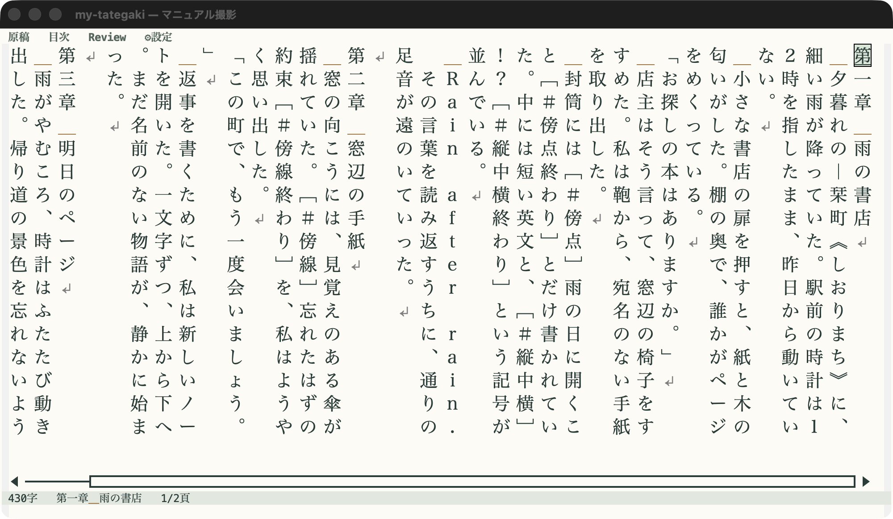
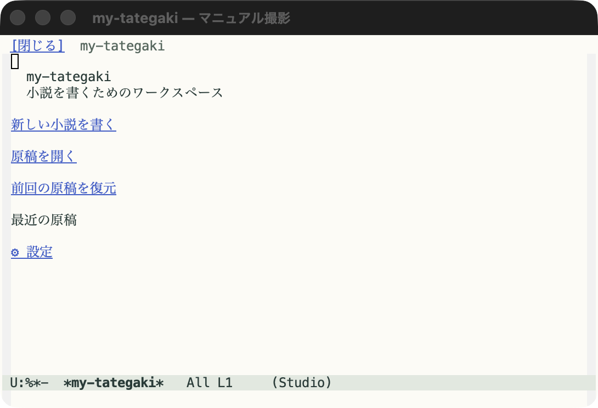
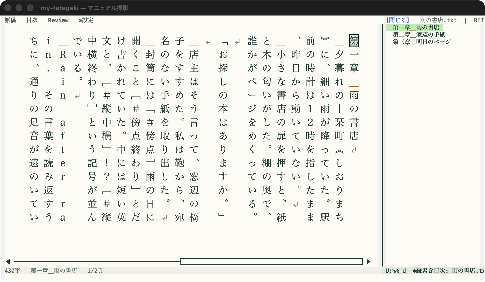
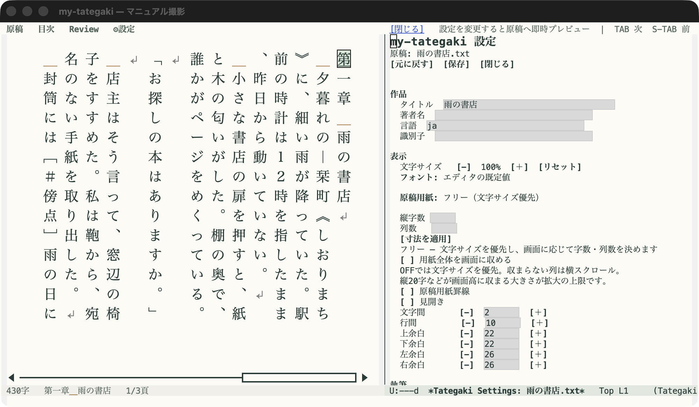
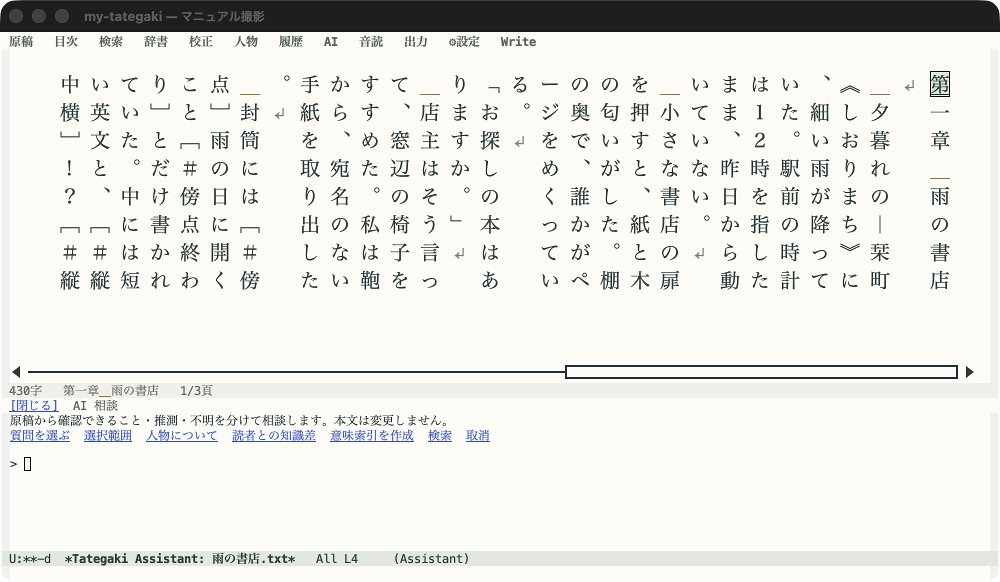
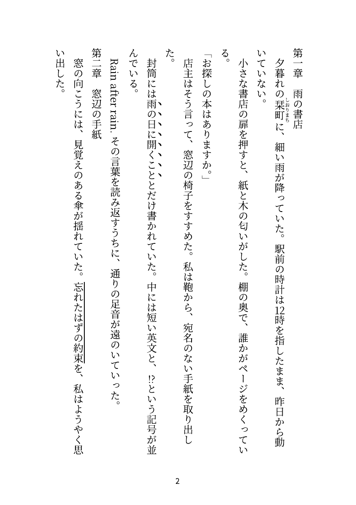

# my-tategaki

**Emacsで縦書きのまま小説を書くための編集環境です。** Novel Studioから、章の目次、表示設定、履歴、校正、人物・作品資料、任意のローカルAI相談、ファイル出力を使えます。本文はプレーンテキストのまま、保存・Undo・検索にはEmacsの仕組みを使います。

[日本語マニュアル](https://modeverv.github.io/my-tategaki/) · [Studioの画面と設定](https://modeverv.github.io/my-tategaki/manual/studio.html) · [コマンド一覧](https://modeverv.github.io/my-tategaki/manual/reference.html) · [困ったとき](https://modeverv.github.io/my-tategaki/manual/troubleshooting.html)



*公開サンプル「雨の書店」をStudioで編集した画面。上部から目次・Review・設定を開けます。*

## 最初の原稿を書く

リポジトリを配置します。

```sh
git clone https://github.com/modeverv/my-tategaki.git ~/src/my-tategaki
```

Emacsの設定へ追加し、評価します。パスは配置先に合わせてください。

```elisp
(add-to-list 'load-path (expand-file-name "~/src/my-tategaki"))
(require 'tategaki)
```

1. **`M-x tategaki-studio`** を実行します。テキスト原稿を開いていればその原稿で開始し、それ以外では開始画面が開きます。
2. 開始画面が開いた場合は、［新しい小説を書く］または［原稿を開く］から執筆を始めます。
3. 固定用紙やルビを表示する場合は、本文ウィンドウで`M-x tategaki-typeset-edit`を実行します。［⚙設定］で文字サイズや原稿用紙を調整します。縦字数・列数を指定するか、固定寸法を使わない［フリー］を選べます。
4. `# 第一章`、`## 第一節` のように見出しを書き、［目次］を開きます。クリックで章へ移動できます。
5. **［原稿］→［保存］**、または **`C-x C-s`** で本文を保存します。設定の［保存］とは別の操作です。

既存原稿から始める場合は `C-x C-f` で開いてからStudioを開始してください。新しい作品では、作品ごとのフォルダに本文を保存してから作品設定を保存すると管理しやすくなります。



*テキスト原稿を開かずにStudioを始めた場合の開始画面です。*

## 執筆から出力まで

| やりたいこと | 使う機能 |
|---|---|
| 縦書きで入力・選択・推敲する | 直接編集、ページ移動、検索、日本語IME、Corfu・Copilotの表示連携 |
| 章を見渡しながら書く | ［目次］で章・節へ移動、階層の折りたたみ、現在章の強調、見出し編集への追従 |
| 読みやすい大きさにする | 文字サイズ、フォント、余白、字間・列間、自由寸法の原稿用紙・フリー・見開き |
| 文章を組版して読む | ルビ、縦中横、禁則・ぶら下げ、傍点・傍線、欧文の回転表示 |
| 過去の原稿と比べる | 自動履歴、別コピー復元、縦書き比較、場面の別案、前回位置の復元 |
| 校正して読み返す | ルール検査、Lookup辞書、Reader、macOS音読 |
| 人物と出来事を整理する | 人物・設定、時系列、伏線、話し方、読者と人物の知識比較 |
| 原稿・資料を参照して相談する | ローカルAI、出典付き検索、登録した原稿・資料の横断検索 |
| 原稿を外へ渡す | DockerによるTXT・DOCX・PDF・EPUB・HTML出力 |

Writeは原稿と表示中の目次を残す執筆画面、Reviewは補助ペインを使う推敲画面です。全操作は［原稿］メニューから開けます。ペイン上部の［閉じる］で原稿へ戻れます。



*［目次］を開くと、章を選びながら本文を編集できます。*

本文は元の原稿バッファに保持します。表示設定は本文を変更せず、履歴の復元は別コピーになります。AIの回答や抽出した人物設定は、作者が根拠を確認して使う補助情報です。

## 必要なもの

| 機能 | 要件 |
|---|---|
| 基本編集・Studio | Emacs 27.1以降、`text-mode`またはその派生モード、日本語フォント |
| ルビなどの組版表示 | SVGを表示できるGUI版Emacs |
| AI相談・意味検索 | Ollama、LM Studio等の対応APIサーバー。AIは既定で無効 |
| 辞書 | Emacs Lookupと利用者の辞書設定 |
| 音読 | macOSの`say`コマンド |
| 旧稿との比較 | `diff`コマンド |
| 5形式への出力 | DockerとCompose |

主な実機検証環境は **macOS / Emacs 31.1 / Apple Silicon** です。macOSのIME候補位置補正は対応するNS入力関数に依存します。補完やAI、Dockerなどの追加機能がなくても基本編集を使えます。対応範囲は[マニュアルの確認環境](docs/manual/troubleshooting.html#support)を参照してください。

## 表示・設定・保存

上部の［⚙設定］では、タイトル・著者名、文字サイズ、フォント、原稿用紙、自動履歴、校正、AI、音読を調整できます。

- 用紙の**縦字数・列数は各1〜200**。入力後に［寸法を適用］を押します。
- **フリー**は固定寸法を使わず、文字サイズと画面の大きさで表示を決めます。
- 文字が小さい場合は［＋］で拡大します。固定用紙では縦の字数が画面高に収まる大きさが上限です。
- ［用紙全体を画面に収める］をONにすると全体表示のため縮小します。OFFでは入らない列を横スクロールで読みます。
- 設定の保存先は**現在の原稿だけ／この作品／全作品の既定値**。優先順位もこの順です。

作品設定は `.tategaki/project.json`、本文の履歴と前回位置はそれぞれ別の場所へ保存します。[設定の保存先](docs/manual/studio.html#scope)と[履歴・再開](docs/manual/history.html)を参照してください。



*設定ペインでは作品情報、文字サイズ、用紙や余白を確認できます。*

## よく使う操作

| 操作 | コマンド・キー |
|---|---|
| Studioを始める | `M-x tategaki-studio` |
| 原稿メニュー / 設定 | `C-c s m` / `C-c s s` |
| 目次を開く・閉じる | `C-c s o` |
| Write / Review | `C-c s w` / `C-c s r` |
| 履歴 / AI相談 | `C-c s h` / `C-c s a` |
| 次／前の画面 | `C-v` / `M-v` |
| 文字の拡大／縮小／標準倍率 | `M-+` / `M--` / `M-0` |
| 本文を保存 / Undo | `C-x C-s` / `C-/` |
| 組版表示で編集する | `M-x tategaki-typeset-edit` |
| 縦書きを終了する | `C-c C-c` |

Studioを使わず、`M-x tategaki-edit`で縦書き編集だけを始めることもできます。Studioを終了する場合は［原稿］→［Studio を終了］を選びます。縦書き自体はその後も残ります。

横書きの編集に読み取り専用の縦書きプレビューを添える場合は、`(require 'org-tategaki-preview)`の後に`M-x tategaki-preview`を実行します。[導入と表示方法](docs/manual/getting-started.html)で違いを説明しています。

## ローカルAIを使う

LLMサーバーを起動し、［⚙設定］のAI欄で［ローカルLLMを使用］を有効にします。Providerから **Ollama** または **LM Studio** を選び、［標準URLを使う］、［モデル一覧を取得］で接続とモデル名を確認します。

会話用の **Model** と、意味検索用の **Embedding Model** は別に選びます。一覧は用途を自動判定しません。モデル名とポートは利用中のサーバーに合わせてください。Providerの変更時も独自に入力した接続先は保持します。

意味索引がない場合や古い場合は語句検索へ切り替えます。人物に相談する機能では、作者が許可した出典範囲に文脈を制限します。外部の接続先への本文送信には確認が入ります。送信する情報とモデルごとの設定は[AI・検索マニュアル](docs/manual/ai.html)を参照してください。



*AI相談ペインの入力画面です。画像は接続前の状態で、回答は表示していません。*

## EPUBなどへ書き出す

リポジトリ直下で出力環境を用意します。初回ビルドにはネット接続が必要です。

```sh
./bin/tategaki-export build
./bin/tategaki-export doctor
```

Emacsの［原稿］→［出力］で形式を選ぶか、`M-x tategaki-export-all`で5形式を生成します。開始時点の未保存本文を含むスナップショットを使い、処理中も執筆を続けられます。

```sh
./bin/tategaki-export export "本文.txt" \
  --profile preview --formats txt,docx,pdf,epub,html --out ./dist
```

画面・PDF・DOCX・EPUBでは組版や改ページが異なります。利用先のアプリで最終表示を確認してください。[出力マニュアル](docs/manual/export.html)に、形式ごとの対応、出力設定、取消、ログの読み方をまとめています。



*公開サンプル「雨の書店」のPDF出力例。本文ページを画像化したものです。*

## マニュアルと検証記録

マニュアルは[公開サイト](https://modeverv.github.io/my-tategaki/)と、同梱の[docs/index.html](docs/index.html)で読めます。手元の実装に対応する内容は同梱版を参照してください。

| 章 | 内容 |
|---|---|
| [導入](docs/manual/getting-started.html)・[Studio](docs/manual/studio.html) | 最初の原稿、画面、設定と保存 |
| [編集](docs/manual/editing.html)・[組版](docs/manual/typesetting.html) | 入力・移動、IME、フォント、ルビ、用紙 |
| [執筆支援](docs/manual/writing.html)・[履歴](docs/manual/history.html) | 目次、脚本、校正、復元、比較、Reader、音読 |
| [AI・検索](docs/manual/ai.html)・[人物・作品設定](docs/manual/world.html) | 接続、資料、候補抽出、時系列、伏線、知識差 |
| [出力](docs/manual/export.html)・[リファレンス](docs/manual/reference.html)・[困ったとき](docs/manual/troubleshooting.html) | 書き出し、操作一覧、対処と制限 |

実測結果は[Studio](docs/novel-studio-validation.md)、[縦書き・組版](docs/vertical-typesetting-validation.md)、[Docker出力](docs/docker-export-validation.md)の検証記録を参照してください。実装計画や検証記録は過去の経緯も含むため、日常の操作は利用マニュアルを参照してください。

## 開発時の確認

通常のERTをリポジトリ直下から実行します。

```sh
emacs --batch -Q -L . --eval '(setq load-prefer-newer t)' \
  --eval '(dolist (file (directory-files "test" t "-test\\.el$")) (unless (featurep (intern (file-name-base file))) (load file nil t)))' \
  -f ert-run-tests-batch-and-exit
```

GUIテストは専用のEmacsプロセスで実行します。終了時にプロセスを閉じるため、執筆中のEmacsへテストファイルを読み込まないでください。

```sh
emacs -Q -l /absolute/path/to/my-tategaki/test/tategaki-studio-graphical-tests.el
```

マニュアルは外部ライブラリなしで生成できます。

```sh
python3 tools/build-manual.py
python3 -m http.server 8769 --directory docs --bind 127.0.0.1
```

[マニュアル保守ガイド](docs/MANUAL-MAINTENANCE.md)と[出力の開発手順](docs/docker-export-guide.md)に、検証・更新手順を記載しています。

## ライセンス

Copyright (C) 2026 seijiro and contributors.

**GPL-3.0-or-later**。ライセンス本文は[LICENSE](LICENSE)、適用範囲と第三者ソフトウェア・フォントの扱いは[LICENSING.md](LICENSING.md)を参照してください。
