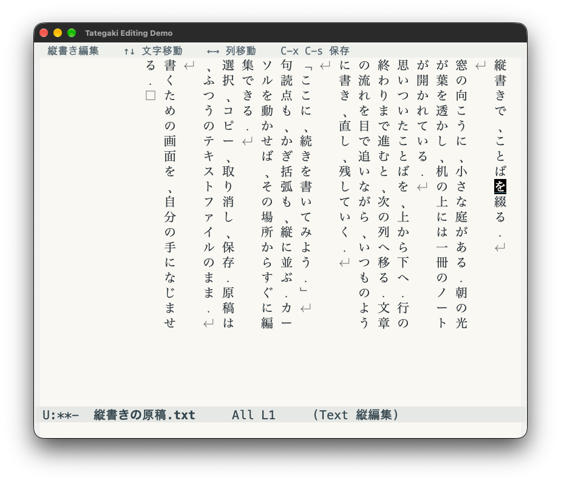

# my-tategaki

Emacs でテキストを縦書きのまま入力・編集する `tategaki-mode` と、横書きの編集画面に縦書き表示を添える `tategaki-preview` です。どちらも pure Elisp で動作し、ブラウザや外部プログラムは使いません。

## 縦書きで書く

Emacs 27.1 以降が対象です。このディレクトリを `load-path` に追加し、`tategaki` を読み込みます。

```elisp
(add-to-list 'load-path "/path/to/my-tategaki")
(require 'tategaki)
```

テキストファイルを開き、`M-x tategaki-edit` を実行してください。現在のウィンドウが縦書き表示になり、そのまま文字を入力できます。文字は上から下、列は右から左へ進みます。`M-x tategaki-mode` でも有効・無効を切り替えられます。

すでに `org-tategaki-preview` を読み込む設定がある場合も、新版を読み込み直せば `tategaki-edit` をそのまま使えます。

編集対象は元のファイルバッファです。その上に縦書きの表示レイヤーを重ねるため、入力、削除、保存、undo は通常の Emacs の操作を使います。表示を実カーソルの前後に分け、縦書きの各文字へ実カーソルを配置します。終了時は `C-c C-c` で同じ位置の横書き表示に戻れます。元バッファが読み取り専用なら、その制限も引き継ぎます。



Emacs 31.1での実画面です。明朝体・配色と上部のキー案内は、この表示例用に調整しています。

| 操作 | キー・コマンド |
| --- | --- |
| 縦書き編集を開始 | `M-x tategaki-edit` |
| 読む順序で次／前の文字へ | `↓` / `↑` |
| 左／右の縦列へ | `←` / `→` |
| 次／前の縦書きページへ | `C-v` / `M-v`、`PageDown` / `PageUp` |
| 文字の位置へ移動 | その文字をクリック |
| 範囲を選択 | `C-SPC` の後に移動、または文字から文字へドラッグ |
| 切り取り／コピー／貼り付け | `C-w` / `M-w` / `C-y` |
| 保存 | `C-x C-s` |
| undo | `C-/` または `C-x u` |
| 再描画 | `C-c C-l` / `M-x tategaki-refresh` |
| 横書きへ戻る | `C-c C-c` / `M-x tategaki-quit` |

上下の矢印は原文の1文字単位で進み、列の末尾では次の列へ移ります。左右の矢印は縦列を移動し、できるだけ同じ高さを保ちます。カーソルが表示範囲を越えると、対応する列を含むページへ表示が切り替わります。`C-f` / `C-b` などは初期設定では元の割り当てを保ち、以下の設定で画面上の方向へ切り替えられます。選択範囲も原文の順序に沿った連続した範囲になります。

対象は `text-mode` とその派生モードです。Markdown・Org でも使えますが、見出し記号などを含めて原文をそのまま並べます。新規バッファが `fundamental-mode` の場合は、先に `M-x text-mode` を実行してください。

`C-v` は左側の次ページ、`M-v` は右側の前ページへ移動します。1ページは現在のウィンドウに収まる縦列数で、余白・間隔・リサイズも反映します。できるだけ同じ画面上の行・列を保ち、短い最終ページから戻るときも元の位置を使います。ページ範囲を越える操作は本文の先頭・末尾へ移動します。数値引数はページ数（例：`C-u 2 C-v`）、負数は逆方向、0は移動なしです。

ページ移動は `tategaki-physical-navigation` の値にかかわらず使えます。Corfuで候補を選択中の `C-v` / `M-v` はCorfuの候補ページ送りを優先します。Copilotの未採用提案は通常の取消処理で消してから本文のページを計算します。

## 編集モードの表示と設定

改行1つごとに次の縦列へ進み、空行や行頭・行末の空白も残します。改行は `↵`、タブは `⇥`、文末の挿入位置は `□` で表示します。空のファイルでも `□` に入力できます。これらの記号や、縦書き用に置き換えた約物は表示だけのもので、保存するテキストには追加しません。

GUI ではフォントの幅を測って列を揃え、端末では1文字を半角2セル幅に揃えます。narrowing 中はその範囲を表示・編集します。同じバッファを複数のウィンドウに表示した場合、縦書きレイヤーは選択したウィンドウに追従します。

```elisp
;; nil ならウィンドウの高さに合わせる。
;; 数値なら1列の最大文字数。小さいウィンドウでは収まる高さまで減らす。
(setq tategaki-column-height nil)
;; (setq tategaki-column-height 20)

(setq tategaki-column-spacing 1
      tategaki-layout-use-vertical-forms t)

;; 上下左右の余白。GUIではピクセル単位。
(setq tategaki-padding-top 20
      tategaki-padding-bottom 20
      tategaki-padding-left 24
      tategaki-padding-right 24)

;; 行間＝縦列どうしの横方向の空き、文字間＝文字どうしの縦方向の空き。
(setq tategaki-line-spacing 12
      tategaki-character-spacing 4)

;; tategaki-mode内で、Emacsの移動キーも画面上の方向に合わせる。
;; C-f → 右、C-b → 左、C-n → 下、C-p → 上。
(setq tategaki-physical-navigation t)

;; 表示記号は、それぞれ幅1〜2セルの1文字を指定する。
(setq tategaki-layout-newline-symbol "↵"
      tategaki-layout-tab-symbol "⇥"
      tategaki-layout-eof-symbol "□")

;; フォントや現在位置の色は専用faceで調整できる。
;; (set-face-attribute 'tategaki-face nil :family "...")
;; (set-face-attribute 'tategaki-cursor-face nil :background "#557a22")
```

余白の既定値はすべて `0`、文字間は `0` です。`tategaki-line-spacing` の既定値 `nil` は従来の `tategaki-column-spacing`（半角幅単位）を使います。明示的な `0` は列間の追加の空きをなくします。端末では上下余白・文字間を行数、左右余白・列間を半角セル数として扱います。

余白と間隔を差し引いて1列の文字数と1ページの列数を決めます。左・下には文字が収まらない分の空きが加わり、右端には描画用の小さな余裕が残ります。小さいウィンドウや極端に大きい設定値では、入力位置を表示できる範囲に余白・間隔を縮めます。本文やUndo履歴には影響しません。

`setq` の変更は次の操作・再描画で反映されます。バッファごとに変える場合は `setq-local` を使えます。移動キー設定を `nil` にすると元の割り当てへ戻り、縦書き以外のバッファには影響しません。数値引数・選択範囲も矢印と同じ扱いで、Corfuの候補選択中はCorfuのキー処理を優先します。フォントを変更したら `C-c C-l` で再描画してください。

文字単位の縦書き編集です。禁則処理、欧文回転、縦中横、ルビには対応していません。結合文字やゼロ幅文字にも個別の編集位置を設け、単独では見えない文字を `◌` などの記号で表示します。編集時は表示対象テキスト全体を組み直すため、長文では入力後の更新に時間がかかります。カーソル移動だけならレイアウトを再利用します。

macOSのNS版Emacsでは、IMEの未確定文字列も挿入位置から縦に表示します。入力が列末に達すると左の列へ折り返し、変換中の文節の下線・強調表示も引き継ぎます。確定前の文字は表示用の仮入力で、本文・保存内容・Undo履歴には入りません。確定はEmacs本来の入力処理に任せ、キャンセル時は仮入力を消します。

対応するNS関数が存在する環境で自動的に有効になります。対象の縦書きウィンドウだけに適用し、ミニバッファや通常の編集バッファは標準の入力表示を保ちます。変換途中で縦書きを終了しても、未確定文字列を標準の横書き表示へ戻します。

`mac-ime-panel-offset-x/y` があるNS版では、候補一覧の位置を選択中の文節の先頭文字の右側へ補正します。フォントの幅と高さに合わせて調整し、列の折り返しにも追従します。既存のオフセット設定を基準とし、確定・取消・対象ウィンドウからの移動・縦書き終了時には元へ戻します。候補一覧の向きや候補選択はOSの標準動作です。

Emacs標準のQuail入力に加え、使用中のEmacs 31.1にある実際のNS未確定文字表示関数を専用GUIから呼び出し、描画・文節更新・取消・確定後のUndoを検証しています。OSのキー入力から候補選択までを自動操作した試験ではありません。

### Copilot・Corfuの補完

Copilot のインライン提案と Corfu の選択候補プレビューも、挿入位置から縦に表示して左の列へ折り返します。提案の色や候補の強調を引き継ぎ、採用前の候補は本文や保存内容に入りません。Copilot の全文・一部採用、候補切り替え、Corfu の選択・確定・取消は各パッケージのキーと処理をそのまま使います。

Corfu の候補一覧は横書きのまま、縦書き画面の実際のカーソル位置に追従します。IME変換中はIME表示を優先します。縦書きを終了すると各パッケージの通常表示へ戻ります。インストール済みパッケージが読み込まれたときに自動連携し、Copilot・Corfuを使用していない環境では追加インストール不要です。

### 編集モードの検証

```sh
emacs --batch -Q -L . -l org-tategaki-preview.el -l tategaki-layout.el -l tategaki.el \
  -l test/org-tategaki-preview-test.el -l test/tategaki-layout-test.el \
  -l test/tategaki-test.el -l test/tategaki-ime-test.el \
  -l test/tategaki-completion-test.el -l test/tategaki-corfu-test.el \
  -l test/tategaki-navigation-test.el -l test/tategaki-spacing-test.el \
  -l test/tategaki-paging-test.el \
  -f ert-run-tests-batch-and-exit
emacs --batch -Q -L . --eval '(setq byte-compile-error-on-warn t)' \
  -f batch-byte-compile org-tategaki-preview.el tategaki-layout.el tategaki-ime.el \
  tategaki-completion.el tategaki-corfu.el tategaki-navigation.el tategaki.el
```

Emacs 31.1でバッチの128件中124件成功、GUI専用4件スキップ、失敗0件。レイアウト13件・編集機能23件・IME連携22件・補完連携19件・移動設定7件・余白と間隔8件・ページ移動12件を含みます。バイトコンパイルは警告なしです。

専用GUIでは編集モード8件と従来プレビュー8件が全て成功しました。カーソルを全位置へ動かしても文字の画面座標が変わらないこと、小さいウィンドウ・大きいフォントで最下段と文末が見えること、列をまたぐドラッグ選択と切り取りも確認しています。

IME連携追加後の回帰確認では編集モード8件に加え、NS未確定文字のGUIテスト6件が成功しました。後者は折り返し・文節face・画面上のカーソル位置・短縮・取消・確定とUndo・変換途中の表示引き継ぎ・候補位置の補正と復元を検証します。

補完連携は Copilot 20260331.713、Corfu 20260913.1527 で検証しています。実際のパッケージの表示・採用処理を使い、CopilotのGUI3件、CorfuのGUI4件が成功しました。空文書・文末の採用キー、縦列をまたぐ提案、Corfuの実際の候補ウィンドウの座標、下端での上側表示、文字拡大、確定・Undoを検証します。Copilotサーバーへの生成リクエストは行わず、テスト用の提案文を表示関数へ渡します。

余白・間隔・物理方向キーのGUI4件では、1ピクセルの上余白、文字間・列間の実寸、列間を変えても右余白が変わらないこと、全位置の実カーソル、空本文、小さい画面と過大設定での文末表示を検証します。今回の変更後は編集8件を再確認し、IME6件・Copilot3件・Corfu4件も上下左右の余白と間隔を指定した状態で成功しました。

ページ移動追加後は専用GUI4件で `C-v` / `M-v` / `PageDown` / `PageUp` の実カーソル座標、短い最終ページとの往復、数値引数、リサイズ、長いCopilot提案の取消後の移動を確認し、既存の編集GUI8件も再確認しています。Corfuの候補ページ送りと通常バッファのキー保持は、実パッケージを使ったバッチテストで確認します。

実カーソルの画面座標と文字の対応、矢印・挿入・削除、日本語入力、空文書・文末、undo・保存、ページ切替・リサイズ、マウス操作は専用GUIプロセスで検証します。実行中の編集用Emacsには読み込まないでください。

```sh
emacs -Q -l /absolute/path/to/my-tategaki/test/tategaki-graphical-tests.el
emacs -Q -l /absolute/path/to/my-tategaki/test/tategaki-ime-graphical-tests.el
emacs -Q -l /absolute/path/to/my-tategaki/test/tategaki-completion-graphical-tests.el
emacs -Q -L /path/to/corfu -L /path/to/compat \
  -l /absolute/path/to/my-tategaki/test/tategaki-corfu-graphical-tests.el
emacs -Q -l /absolute/path/to/my-tategaki/test/tategaki-spacing-graphical-tests.el
emacs -Q -l /absolute/path/to/my-tategaki/test/tategaki-paging-graphical-tests.el
```

終了コードは成功0、失敗1、起動条件の不備・60秒タイムアウト2です。ログは `temporary-file-directory` 内の `tategaki-gui-tests.log` / `tategaki-ime-gui-tests.log` に保存されます。IME用GUIテストにはNS版Emacsと `ns-put-marked-text` が必要です。

## 従来の縦書きプレビュー

横書きの編集画面を残したい場合は、従来の `tategaki-preview` を使えます。text-mode 系の文書（プレーンテキスト・Markdown・Org など）を右で編集し、左の Emacs window で縦書きの流れを確認します。以下はプレビュー機能の説明です。


右側の文章を編集しながら、左側で縦書きの流れを確認できます。緑色の帯はカーソル位置に対応する縦列、明るい緑色は現在の文字です（Emacs 31.1 / macOS、Org バッファの表示例）。

### プレビューの読み込みと操作

Emacs 27.1 以降が対象です（検証環境: Emacs 31.1）。このディレクトリを `load-path` に追加してください。

```elisp
(add-to-list 'load-path "/path/to/my-tategaki")
(require 'org-tategaki-preview)
```

text-mode またはその派生モードのバッファで `M-x tategaki-preview` を実行すると、左側に読み取り専用のプレビューが開きます。選択中のウィンドウは編集側のままです。同じコマンドを再実行すると既存プレビューを再利用します。

別フレームに表示する場合は `M-x tategaki-preview-frame` を実行します。編集側のウィンドウを選択したまま、独立したフレームに縦書きプレビューを開きます。再実行では同じフレームを再利用し、左側にプレビューがある場合は別フレームへ移します。自動更新・カーソル追従・リサイズ時の組み直しも利用できます。プレビューの `q`、`tategaki-preview-close`、またはフレームの閉じる操作で終了します。互換名 `org-tategaki-preview-frame` も使えます。

- 編集を止めて約 0.2 秒後に更新します。
- プレビューの高さ・幅が変わると組み直します。
- 上下には1文字分、左右には黒い固定の余白と本文内の padding を設けます。上下の余白を除いた高さで文字を折り返し、低いウィンドウでは余白を縮めます。追従時は文字が padding の内側に収まるようスクロールします。
- 編集側のカーソル位置に対応する縦列を連続した帯で強調し、現在の文字はさらに明るく表示します。画面外ならプレビューを横スクロールします。編集側のスクロールでカーソルが画面外にある場合は、表示先頭位置に追従します。
- プレビューで `g` を押すと手動更新、`q` で終了します。
- 編集側からも `M-x tategaki-preview-refresh` / `tategaki-preview-close` を使えます。
- `M-x org-tategaki-preview-mode` でも有効・無効を切り替えられます。

プレビューを開くと、編集側の現在位置に追従します。文章は右端から始まります。プレビューを手動で読むときは `C-x <`（`scroll-right`）で左方向へ、`C-x >` で右方向へスクロールできます。編集側の位置を動かすと自動追従に戻ります。ページ切り替えは未実装です。

同期は編集側 → プレビューの一方向です。Org 見出しの `*` や削除される改行上では次の表示文字、文末では最後の文字を強調します。カーソル移動時は位置の対応表を使い、全文の再変換は行いません。

### プレビューの表示ルール

文字を上から下へ並べ、列は右から左へ進みます。GUI では実際に使われるフォントの文字幅を測定し、各列をピクセル単位で固定します。英数字は列の中央に配置します。縦の文字間には追加の空きを入れず、実際のフォントの高さに合わせて均等に詰めます。端末では従来どおり半角文字も最低 2 セル幅に揃えます。単一の改行は連結し、空行は空の列として残します。Org の派生モードでは見出しの先頭の `*` を除き、見出しを独立した段落にします。Org 以外では `*` や `#` を含む本文の記号をそのまま表示します。Markdown などの記法のレンダリングは行いません。

入力は narrowing にかかわらずバッファ全体です。元の文字・テキストプロパティ・保存形式は変更しません。複数の編集バッファはそれぞれ独立したプレビューを持ちます。終了、ソースの major mode 変更、いずれかのバッファの kill 時にタイマーとフックを解除します。

既存の `org-tategaki-preview` コマンド・設定名・`require` は互換性のためそのまま使えます。プログラミングモードや fundamental-mode は対象外です。

### プレビューの設定例

```elisp
(setq org-tategaki-preview-refresh-delay 0.2
      org-tategaki-preview-use-vertical-forms t
      org-tategaki-preview-column-spacing 1
      org-tategaki-preview-window-margin 2
      org-tategaki-preview-padding 1
      org-tategaki-preview-vertical-padding 1)

;; 左右の余白は半角セル単位。変更後はプレビューで g を押す
;; (setq org-tategaki-preview-window-margin 3)

;; 上下の余白は文字の高さ単位。0 で余白なし、2 なら上下2文字分
;; (setq org-tategaki-preview-vertical-padding 2)

;; 手動でプレビューを読み続ける場合は自動追従を無効にする
;; (setq org-tategaki-preview-sync-point nil)

;; 必要ならインストール済みの等幅フォントを指定
;; (set-face-attribute 'org-tategaki-preview-face nil :family "...")

;; 縦列と現在文字の色を変更する場合
;; (set-face-attribute 'org-tategaki-preview-current-column nil :background "#164016")
;; (set-face-attribute 'org-tategaki-preview-current-character nil :background "#557a22")
```

約物は `、。「」『』（ ）［］｛｝〈〉《》` を Unicode の縦書き用文字へ変換します。フォントに字形がない場合は `org-tategaki-preview-use-vertical-forms` を `nil` にしてください。GUI では可変幅フォントや日本語の代替フォントにも対応します。端末では等幅フォントが前提です。フォントを変更したら `g` で再描画してください。

文字単位の簡易表示です。結合文字・絵文字の書記素単位処理、禁則処理、欧文回転、縦中横、ルビ、ページングは未実装です。編集・リサイズ時は全文を変換するため、大きな文書では更新時に待ち時間が生じます。

## プレビューの検証

```sh
emacs --batch -Q -L . -l org-tategaki-preview.el \
  -l test/org-tategaki-preview-test.el -f ert-run-tests-batch-and-exit
emacs --batch -Q -L . --eval '(setq byte-compile-error-on-warn t)' \
  -f batch-byte-compile org-tategaki-preview.el
```

ERT は方向、セル幅、約物、段落、元バッファ保護、ウィンドウ再利用、debounce、リサイズ、複数ソース、終了処理を検証します。バッチ実行では idle timer のコールバックとリサイズ通知を明示的に呼び出します。

GUI のテストは専用プロセスで実行します。日本語・英数字の混在した長文で、横スクロール後の再描画、文字の欠け、行高の均一性、縦列の強調とカーソル・スクロール同期に加え、別フレームの作成・再利用・移動・終了処理を検証します。バッチでは GUI 専用の4件をスキップします。

```sh
emacs -Q -l /absolute/path/to/my-tategaki/test/graphical-tests.el
```

終了コードは成功時 0、テスト失敗時 1、起動条件の不備・60秒タイムアウト時 2 です。結果は Emacs の `temporary-file-directory` 内の `org-tategaki-preview-gui-tests.log` に保存します。macOS の GUI 起動では作業ディレクトリが変わることがあるため、絶対パスを指定してください。

GUI の列揃えは別の Emacs プロセスで `emacs -Q -L . -l test/graphical-smoke.el` を実行して検証できます。このプロセスはテスト後に終了するため、編集中の Emacs にこのテストファイルを読み込まないでください。Helvetica と日本語を混在させ、横スクロール中の実描画座標と、全文の描画高さがウィンドウ内に収まることを確認します。バッチでは GUI テスト 2 件をスキップします。

実際の対話イベントループで自動更新・リサイズ通知・終了処理を確認するスモークテストも用意しています。専用の Emacs プロセスで実行してください（成功時 0、失敗時 1、15 秒のタイムアウト時 2 で終了します）。

```sh
emacs -Q -nw -L . -l test/interactive-smoke.el
```

Emacs 31.1 で通常の ERT 20 件、GUI の整列・同期・padding・行高・text-mode・別フレーム対応テスト8件が成功しました。バイトコンパイルも警告なしで完了しています。

対話環境での確認例:

```org
* 第一章

吾輩は猫である。
名前はまだ無い。

「こんにちは。」
```

プレビューを開き、「猫」を「犬」に書き換えて自動更新を確認します。フレームの高さを変え、列の文字数が変わることを確認し、最後にプレビューで `q` を押して閉じます。
