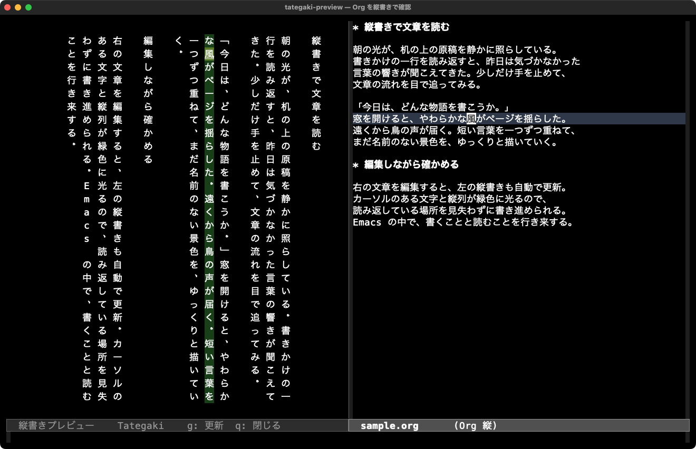

# tategaki-preview

text-mode 系の文書（プレーンテキスト・Markdown・Org など）を右で編集し、左の Emacs window で疑似縦書きを確認する pure Elisp の MVP です。ブラウザや外部プログラムは使いません。



右側の文章を編集しながら、左側で縦書きの流れを確認できます。緑色の帯はカーソル位置に対応する縦列、明るい緑色は現在の文字です（Emacs 31.1 / macOS、Org バッファの表示例）。

## 読み込みと操作

Emacs 27.1 以降が対象です（検証環境: Emacs 31.1）。このディレクトリを `load-path` に追加してください。

```elisp
(add-to-list 'load-path "/path/to/my-tategaki")
(require 'org-tategaki-preview)
```

text-mode またはその派生モードのバッファで `M-x tategaki-preview` を実行すると、左側に読み取り専用のプレビューが開きます。選択中のウィンドウは編集側のままです。同じコマンドを再実行すると既存プレビューを再利用します。

- 編集を止めて約 0.2 秒後に更新します。
- プレビューの高さ・幅が変わると組み直します。
- 上下には1文字分、左右には黒い固定の余白と本文内の padding を設けます。上下の余白を除いた高さで文字を折り返し、低いウィンドウでは余白を縮めます。追従時は文字が padding の内側に収まるようスクロールします。
- 編集側のカーソル位置に対応する縦列を連続した帯で強調し、現在の文字はさらに明るく表示します。画面外ならプレビューを横スクロールします。編集側のスクロールでカーソルが画面外にある場合は、表示先頭位置に追従します。
- プレビューで `g` を押すと手動更新、`q` で終了します。
- 編集側からも `M-x tategaki-preview-refresh` / `tategaki-preview-close` を使えます。
- `M-x org-tategaki-preview-mode` でも有効・無効を切り替えられます。

プレビューを開くと、編集側の現在位置に追従します。文章は右端から始まります。プレビューを手動で読むときは `C-x <`（`scroll-right`）で左方向へ、`C-x >` で右方向へスクロールできます。編集側の位置を動かすと自動追従に戻ります。ページ切り替えは未実装です。

同期は編集側 → プレビューの一方向です。Org 見出しの `*` や削除される改行上では次の表示文字、文末では最後の文字を強調します。カーソル移動時は位置の対応表を使い、全文の再変換は行いません。

## 表示ルール

文字を上から下へ並べ、列は右から左へ進みます。GUI では実際に使われるフォントの文字幅を測定し、各列をピクセル単位で固定します。英数字は列の中央に配置します。縦の文字間には追加の空きを入れず、実際のフォントの高さに合わせて均等に詰めます。端末では従来どおり半角文字も最低 2 セル幅に揃えます。単一の改行は連結し、空行は空の列として残します。Org の派生モードでは見出しの先頭の `*` を除き、見出しを独立した段落にします。Org 以外では `*` や `#` を含む本文の記号をそのまま表示します。Markdown などの記法のレンダリングは行いません。

入力は narrowing にかかわらずバッファ全体です。元の文字・テキストプロパティ・保存形式は変更しません。複数の編集バッファはそれぞれ独立したプレビューを持ちます。終了、ソースの major mode 変更、いずれかのバッファの kill 時にタイマーとフックを解除します。

既存の `org-tategaki-preview` コマンド・設定名・`require` は互換性のためそのまま使えます。プログラミングモードや fundamental-mode は対象外です。

## 設定例

```elisp
(setq org-tategaki-preview-refresh-delay 0.2
      org-tategaki-preview-use-vertical-forms t
      org-tategaki-preview-column-spacing 1
      org-tategaki-preview-window-margin 2
      org-tategaki-preview-padding 1
      org-tategaki-preview-vertical-padding 1)

;; 左右の余白は半角セル単位。変更後はプレビューで g を押す
;; (setq org-tategaki-preview-window-margin 3)

;; 上下の余白は文字の高さ単位。0 で余白なし、2 なら上下2文字分
;; (setq org-tategaki-preview-vertical-padding 2)

;; 手動でプレビューを読み続ける場合は自動追従を無効にする
;; (setq org-tategaki-preview-sync-point nil)

;; 必要ならインストール済みの等幅フォントを指定
;; (set-face-attribute 'org-tategaki-preview-face nil :family "...")

;; 縦列と現在文字の色を変更する場合
;; (set-face-attribute 'org-tategaki-preview-current-column nil :background "#164016")
;; (set-face-attribute 'org-tategaki-preview-current-character nil :background "#557a22")
```

約物は `、。「」『』（ ）［］｛｝〈〉《》` を Unicode の縦書き用文字へ変換します。フォントに字形がない場合は `org-tategaki-preview-use-vertical-forms` を `nil` にしてください。GUI では可変幅フォントや日本語の代替フォントにも対応します。端末では等幅フォントが前提です。フォントを変更したら `g` で再描画してください。

文字単位の簡易表示です。結合文字・絵文字の書記素単位処理、禁則処理、欧文回転、縦中横、ルビ、ページングは未実装です。編集・リサイズ時は全文を変換するため、大きな文書では更新時に待ち時間が生じます。

## 検証

```sh
emacs --batch -Q -L . -l org-tategaki-preview.el \
  -l test/org-tategaki-preview-test.el -f ert-run-tests-batch-and-exit
emacs --batch -Q -L . --eval '(setq byte-compile-error-on-warn t)' \
  -f batch-byte-compile org-tategaki-preview.el
```

ERT は方向、セル幅、約物、段落、元バッファ保護、ウィンドウ再利用、debounce、リサイズ、複数ソース、終了処理を検証します。バッチ実行では idle timer のコールバックとリサイズ通知を明示的に呼び出します。

GUI のテストは専用プロセスで実行します。日本語・英数字の混在した長文で、横スクロール後の再描画、文字の欠け、行高の均一性、縦列の強調とカーソル・スクロール同期を検証します。バッチでは GUI 専用の2件をスキップします。

```sh
emacs -Q -l /absolute/path/to/my-tategaki/test/graphical-tests.el
```

終了コードは成功時 0、テスト失敗時 1、起動条件の不備・60秒タイムアウト時 2 です。結果は Emacs の `temporary-file-directory` 内の `org-tategaki-preview-gui-tests.log` に保存します。macOS の GUI 起動では作業ディレクトリが変わることがあるため、絶対パスを指定してください。

GUI の列揃えは別の Emacs プロセスで `emacs -Q -L . -l test/graphical-smoke.el` を実行して検証できます。このプロセスはテスト後に終了するため、編集中の Emacs にこのテストファイルを読み込まないでください。Helvetica と日本語を混在させ、横スクロール中の実描画座標と、全文の描画高さがウィンドウ内に収まることを確認します。バッチでは GUI テスト 2 件をスキップします。

実際の対話イベントループで自動更新・リサイズ通知・終了処理を確認するスモークテストも用意しています。専用の Emacs プロセスで実行してください（成功時 0、失敗時 1、15 秒のタイムアウト時 2 で終了します）。

```sh
emacs -Q -nw -L . -l test/interactive-smoke.el
```

Emacs 31.1 で通常の ERT 20 件、GUI の整列・同期・padding・行高・text-mode 対応テスト6件が成功しました。バイトコンパイルも警告なしで完了しています。

対話環境での確認例:

```org
* 第一章

吾輩は猫である。
名前はまだ無い。

「こんにちは。」
```

プレビューを開き、「猫」を「犬」に書き換えて自動更新を確認します。フレームの高さを変え、列の文字数が変わることを確認し、最後にプレビューで `q` を押して閉じます。
