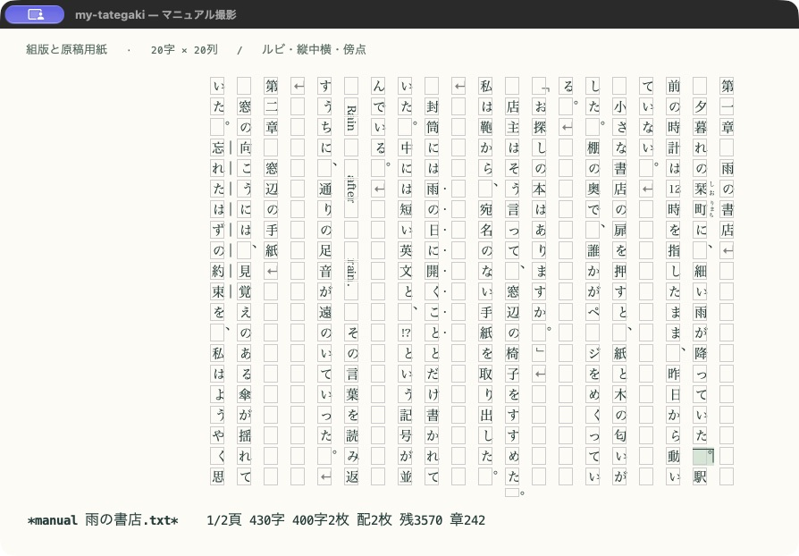

# my-tategaki

Emacsで日本語の原稿を縦書きのまま編集する拡張です。元のテキストバッファに表示レイヤーを重ねるため、保存・Undo・検索・コピーには通常のEmacsの操作を使えます。

**[日本語マニュアル](https://modeverv.github.io/my-tategaki/)** · [設定リファレンス](https://modeverv.github.io/my-tategaki/manual/reference.html#settings) · [困ったとき](https://modeverv.github.io/my-tategaki/manual/troubleshooting.html#first-checks)



## 主な機能

- 縦書きでの直接入力、範囲選択、ページ移動、横スクロール
- 禁則・ぶら下げ、ルビ、縦中横、傍点・傍線、欧文の回転表示
- 原稿用紙・見開き、文字数と枚数の表示、執筆目標
- 自動字下げ・括弧補完、脚本・台本モード、アウトライン
- macOS NS版のIME、Copilot・Corfuとの表示連携
- 横書き編集を残す読み取り専用プレビュー
- 任意のDocker環境によるTXT・DOCX・PDF・EPUB・HTML出力

## 要件

- Emacs **27.1以降**。直接編集は `text-mode` とその派生モードが対象です。
- ルビ等の組版表示と縮小した原稿用紙表示には、**GUI・SVG対応・日本語フォント**が必要です。
- 編集・プレビューはEmacs Lispのみで動作します。Dockerは出力機能を使う場合だけ必要です。

主な実機検証環境はmacOSのEmacs 31.1です。対応するNS入力関数がない環境では、IME未確定文字の縦書き表示や候補位置補正は利用できません。

## インストール

リポジトリをローカルへcloneします。

```sh
git clone https://github.com/modeverv/my-tategaki.git ~/src/my-tategaki
```

`init.el` に追加し、評価またはEmacsを再起動します。パスは配置先に合わせて変更してください。

```elisp
(add-to-list 'load-path (expand-file-name "~/src/my-tategaki"))
(require 'tategaki)
```

`use-package` を使用している場合は、上記の代わりにローカルのcloneを次のように読み込めます。

```elisp
(use-package tategaki
  :ensure nil
  :load-path "~/src/my-tategaki"
  :demand t)
```

更新はcloneしたディレクトリで `git pull` を実行し、Emacsを再起動して反映します。出力機能も更新した場合はDockerイメージを再構築してください。

## クイックスタート

1. `C-x C-f` で `.txt` ファイルを開きます。新規バッファが `fundamental-mode` の場合は、先に `M-x text-mode` を実行します。
2. `M-x tategaki-edit` を実行し、そのまま入力します。文字は上から下、列は右から左へ進みます。
3. `C-x C-s` で保存、`C-/` でUndoします。
4. `C-c C-c` で同じ位置の横書き表示へ戻ります。

禁則やルビを使う場合は `M-x tategaki-typeset-edit` を実行します。たとえば `｜青空《あおぞら》` と書くと、親文字の右側へ読みを表示します。注記を含む原文はそのまま保存されます。

表示の切り替えは本文を変更しません。ルビの挿入、自動字下げ、脚本整形は通常の本文編集なので、保存・Undoの対象です。読み取り専用のバッファはその制限を引き継ぎます。

## 主要コマンドとキー

| 操作 | コマンド・キー |
|---|---|
| 縦書き編集を開始 | `M-x tategaki-edit` |
| 組版表示で開始 | `M-x tategaki-typeset-edit` |
| 読む順序で次／前の文字へ | `↓` / `↑` |
| 左／右の縦列へ | `←` / `→` |
| 次／前の画面へ | `C-v` / `M-v`、`PageDown` / `PageUp` |
| 文字を拡大／縮小する（GUI） | `M-+`（または `M-=`）/ `M--` |
| 文字を標準倍率に戻す（GUI） | `M-0` |
| 範囲選択 | `C-SPC` の後に移動、またはドラッグ |
| コピー／切り取り／貼り付け | `M-w` / `C-w` / `C-y` |
| 選択範囲にルビを付ける | `C-c C-r` / `M-x tategaki-insert-ruby` |
| 注記の組版表示／原文表示を切り替える | `C-c C-a` |
| アウトライン | `C-c C-o` / `M-x tategaki-outline` |
| 原稿用紙の版面を選ぶ | `M-x tategaki-manuscript-set-preset` |
| 指定した文書ページへ移動 | `C-c C-p` / `M-x tategaki-goto-page` |
| 脚本・台本モードを開始 | `M-x tategaki-script-mode` |
| 再描画／縦書きを終了 | `C-c C-l` / `C-c C-c` |

`C-v` / `M-v` は画面単位、`tategaki-goto-page` は文書の版面単位で移動します。Corfuなどの補完候補を選んでいる間は、補完側の移動キーを優先します。

`M-+` / `M--` は現在の原稿の縦書き表示を拡大・縮小します。固定原稿用紙では字数・列数を維持し、画面に収まる大きさまで拡大できます。通常のEmacsの文字拡大とは独立した操作です。詳しくは[文字の大きさ](https://modeverv.github.io/my-tategaki/manual/editing.html#text-size)を参照してください。

## 設定例

次はGUIで使う表示設定の例です。`tategaki` を読み込んだ後に設定してください。

```elisp
(require 'tategaki)

;; 余白・列間・字間。GUIではピクセル単位
(setq tategaki-padding-top 20
      tategaki-padding-bottom 20
      tategaki-padding-left 16
      tategaki-padding-right 16
      tategaki-line-spacing 12
      tategaki-character-spacing 2)

;; C-f / C-b / C-n / C-p を画面上の右 / 左 / 下 / 上へ
;; nil（既定）なら通常のEmacsの移動を保つ
(setq tategaki-physical-navigation t)

;; 新しく扱う文書の既定を組版表示・20字×20列にする
(setq-default tategaki-typesetting t
              tategaki-manuscript-size '(20 . 20))

;; 執筆支援。別の括弧補完を使う場合はelectric-pairをnilにする
(setq tategaki-writing-assistance t
      tategaki-writing-paragraph-indent 1
      tategaki-writing-dialogue-indent 0
      tategaki-writing-electric-pair t)
```

現在の原稿だけに適用する設定は `setq-local` を使います。たとえば `(setq-local tategaki-manuscript-target-characters 20000)` で目標文字数を設定できます。

組版・原稿用紙には自動的にバッファローカルになる設定があります。全原稿の既定を変える `setq-default` と、現在の原稿を変える `setq-local` の違いは[設定の有効範囲](https://modeverv.github.io/my-tategaki/manual/reference.html#setting-scope)を参照してください。表示変更後は `C-c C-l` で再描画できます。

## 縦書きプレビュー

横書きで編集を続けながら縦書きを確認する場合は、追加で読み込みます。

```elisp
(require 'org-tategaki-preview)
```

`M-x tategaki-preview` で左側のウィンドウ、`M-x tategaki-preview-frame` で別フレームに開きます。プレビュー内の `g` で更新、`q` で閉じます。編集に追従して自動更新します。

プレビューは読み取り専用で、直接編集とは改行の扱いが異なります。禁則・ルビ等の組版が必要な場合は `tategaki-typeset-edit` を使ってください。[プレビューの説明](https://modeverv.github.io/my-tategaki/manual/getting-started.html#preview)

## Dockerで出力する（任意）

DockerとComposeを用意し、リポジトリ内で実行します。初回ビルドにはネット接続が必要です。通常の出力はネット接続なしのコンテナで動作し、ホストにPython・Node・Java・Pandocを個別に用意する必要はありません。

```sh
./bin/tategaki-export build
./bin/tategaki-export doctor
```

Emacsの `M-x tategaki-export-all` で5形式すべて、`M-x tategaki-export` で選んだ形式を出力します。開始時点の未保存本文をスナップショットにし、執筆を続けながら別プロセスで処理します。結果は `M-x tategaki-export-status` で確認できます。

CLIではUTF-8の原稿を指定します。

```sh
./bin/tategaki-export export "小説 原稿.txt" \
  --profile preview --formats txt,docx,pdf,epub,html --out ./dist
```

出力範囲の既定はnarrowingにかかわらず全文です。部分出力は `C-u M-x tategaki-export` で選びます。用紙・書誌情報・フォント・取消・失敗ログは[出力マニュアル](https://modeverv.github.io/my-tategaki/manual/export.html#emacs)を参照してください。

## マニュアル

| 目的 | 読むページ |
|---|---|
| 入力・移動・余白を調整する | [編集の基本](https://modeverv.github.io/my-tategaki/manual/editing.html#editing-basics)・[余白と間隔](https://modeverv.github.io/my-tategaki/manual/editing.html#spacing) |
| IME・Copilot・Corfuを使う | [日本語入力](https://modeverv.github.io/my-tategaki/manual/editing.html#ime)・[補完連携](https://modeverv.github.io/my-tategaki/manual/editing.html#completion) |
| ルビ・禁則・縦中横を使う | [ルビと注記](https://modeverv.github.io/my-tategaki/manual/typesetting.html#ruby)・[禁則](https://modeverv.github.io/my-tategaki/manual/typesetting.html#kinsoku)・[縦中横](https://modeverv.github.io/my-tategaki/manual/typesetting.html#tcy-and-latin) |
| 原稿用紙・文字数・目標を使う | [固定版面](https://modeverv.github.io/my-tategaki/manual/typesetting.html#manuscript)・[文字数と枚数](https://modeverv.github.io/my-tategaki/manual/typesetting.html#statistics) |
| 小説・脚本を書く | [執筆支援](https://modeverv.github.io/my-tategaki/manual/writing.html#prose)・[脚本モード](https://modeverv.github.io/my-tategaki/manual/writing.html#script)・[アウトライン](https://modeverv.github.io/my-tategaki/manual/writing.html#outline) |
| 提出・校正・電子書籍にする | [出力設定](https://modeverv.github.io/my-tategaki/manual/export.html#profiles)・[出力後の確認](https://modeverv.github.io/my-tategaki/manual/export.html#compatibility) |
| 設定を調べる・問題を切り分ける | [リファレンス](https://modeverv.github.io/my-tategaki/manual/reference.html#settings)・[トラブル対処](https://modeverv.github.io/my-tategaki/manual/troubleshooting.html#first-checks) |

マニュアルはリポジトリ内の [docs/index.html](docs/index.html) からローカルでも読めます。

## 既知の制限

- GUI・SVGがない環境では、注記を含む原文の文字表示へ戻ります。組版は青空文庫記法・Unicode文字分割・日本語組版の限定した対応です。
- IME候補一覧はOS標準の横書きです。未確定文字の縦書き表示と候補位置補正は対応するNS版Emacsに依存します。
- 画面の版面・400字換算・DOCX・PDF・EPUBのページ数は別の指標です。
- DOCXはLibreOfficeで描画・再保存を検証しています。Wordの最終実表示は未確認で、LibreOfficeでは一部ZWJ絵文字が分かれて見えます。
- PDFは現在 `Noto Serif CJK JP` に限定します。固定字数・列数、印刷所別PDF/X・塗り足し・色変換は未対応です。
- EPUBのフォント埋め込み・画像表紙は未対応です。Apple Books 9.0では `&` / `<` / `>` を含む章名の目次に既知の問題があり、Kindle Previewerは未検証です。
- Dockerの実機検証はApple Silicon / linux/aarch64で行っています。amd64での実行は未確認です。

実施した検査と残る制約は[編集・組版の検証記録](docs/vertical-typesetting-validation.md)と[出力の検証記録](docs/docker-export-validation.md)に記載しています。

## 開発・確認

リポジトリ直下から、編集・プレビューのバッチテストを実行できます。

```sh
emacs --batch -Q -L . --eval '(setq load-prefer-newer t)' \
  --eval '(dolist (file (directory-files "test" t "-test\\.el$")) (load file nil t))' \
  -f ert-run-tests-batch-and-exit
```

GUI試験は専用のEmacsプロセスで実行します。テスト後に終了するため、編集中のEmacsへテストファイルを読み込まないでください。

```sh
emacs -Q -l /absolute/path/to/my-tategaki/test/tategaki-graphical-tests.el
```

出力の単体・Docker統合テストは[出力の開発手順](docs/docker-export-guide.md#開発時の検証)、各GUI試験と検証環境は上記の検証記録を参照してください。マニュアルの更新方法は[保守ガイド](docs/MANUAL-MAINTENANCE.md)にまとめています。

## License

Copyright (C) 2026 seijiro and contributors.

GNU General Public License v3.0 or later（**GPL-3.0-or-later**）で公開しています。この条件のもとで利用・改変・再配布でき、無保証で提供します。ライセンス本文は [LICENSE](LICENSE)、適用範囲と第三者ソフトウェア・フォントの扱いは [LICENSING.md](LICENSING.md) を参照してください。
